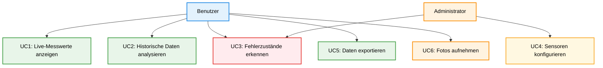

# 3 Anforderungen

## 3.0 Stakeholder & Use-Cases

### Stakeholder

Das System richtet sich primär an:
- **Forscher/Wissenschaftler:** Benötigen präzise, kalibrierte Messwerte für Experimente
- **Hobbygärtner/Enthusiasten:** Möchten ihre Hydroponik-Anlagen überwachen
- **Studierende:** Nutzen das System für Lehrprojekte und Abschlussarbeiten

### Use-Cases

- **UC1:** Live-Überblick über aktuelle Messwerte aller Sensor-Nodes
- **UC2:** Historische Datenanalyse (Trends, Zeitreihen)
- **UC3:** Erkennung von Fehlerzuständen (Node offline, Sensor defekt)
- **UC4:** Konfiguration von Sensoren und Kalibrierung
- **UC5:** Export von Messdaten für externe Analysen (CSV)
- **UC6:** Visuelle Dokumentation des Pflanzenwachstums (Fotos)

Evidence: sensorhub-backend/app/realtime_updates.py :: LiveManager._build_reading_payload :: Live-Readings werden an das Frontend gesendet (UC1). Evidence: sensorhub-backend/app/api/setups.py :: get_history :: Historische Daten (UC2). Evidence: sensorhub-backend/app/nodes.py :: mark_nodes_offline :: Node-Status offline (UC3). Evidence: sensorhub-backend/app/nodes.py :: sync_calibration :: Kalibrierung wird an Node übertragen (UC4). Evidence: sensorhub-backend/app/api/setups.py :: export_all :: CSV/ZIP Export (UC5). Evidence: sensorhub-backend/app/camera_streaming.py :: capture_photo_now/photo_capture_loop :: Fotoaufnahme (UC6).

**Abbildung 3.1: Use-Case-Diagramm des SensorHUB-Systems**

Das Use-Case-Diagramm zeigt die Hauptakteure (**Benutzer** und **Administrator**) sowie die wichtigsten Anwendungsfälle. Benutzer können Live-Daten anzeigen, historische Daten analysieren, Daten exportieren und Fotos aufnehmen. Administratoren konfigurieren Sensoren und überwachen den Systemstatus.

---

Die detaillierten Anforderungen sind in separate Dateien ausgelagert:

- [3.1 Kundenanforderungen (Funktionale Anforderungen)](./03-KUNDENANFORDERUNGEN.md)
- [3.2 Technische Anforderungen](./03-TECHNISCHE-ANFORDERUNGEN.md)

---

## 3.3 Nicht-funktionale Anforderungen

### Zuverlässigkeit

- **NFR-1:** Das System soll bei kurzzeitigen Netzwerkausfällen weiterarbeiten. [NOT-TESTED-YET] Evidence: sensorhub-frontend/src/services/ws.ts :: scheduleReconnect :: Frontend versucht Reconnect; formaler Test ausstehend.
- **NFR-2:** Node-Ausfälle sollen erkannt und gemeldet werden. [CODE-ALIGNED] Evidence: sensorhub-backend/app/nodes.py :: mark_nodes_offline :: Nodes werden als offline markiert.
- **NFR-3:** Messdaten dürfen nicht verloren gehen (Persistenz, Dateiformat). [CODE-ALIGNED] [NOT-TESTED-YET] Evidence: sensorhub-backend/app/db.py :: insert_reading :: Messwerte werden in SQLite gespeichert.

### Wartbarkeit

- **NFR-4:** Der Code soll modular strukturiert sein. [CODE-ALIGNED] Evidence: sensorhub-backend/app/ :: Modulstruktur :: Trennung in API, Nodes, Kamera, DB.
- **NFR-5:** Zentrale Komponenten sollen mit Unit-Tests abgedeckt sein. [NOT-TESTED-YET] Evidence: sensorhub-backend/tests/ :: Testdateien vorhanden, Ausführung nicht erfolgt.
- **NFR-6:** Das System soll gut dokumentiert sein (API, Architektur, Deployment). [CODE-ALIGNED] Evidence: docs/ :: API/Architektur/Protokolle dokumentiert.

### Performance

- **NFR-7:** Das Backend soll Messwerte mit <500ms Response-Zeit verarbeiten. [NOT-TESTED-YET] Evidence: NONE.
- **NFR-8:** Die UI soll auch bei historischen Abfragen mit 10.000+ Datenpunkten flüssig bleiben. [NOT-TESTED-YET] Evidence: NONE.
- **NFR-9:** Mehrere Nodes sollen gleichzeitig Daten senden können ohne Blockierung. [NOT-TESTED-YET] Evidence: sensorhub-backend/app/nodes.py :: NODE_CLIENTS :: Multi-Node-Verwaltung vorhanden; formale Tests fehlen.

### Sicherheit

- **NFR-10:** Das Backend soll ein Login-System besitzen (Passwort-basiert). [MISSING-IN-CODE] Evidence: NONE.
- **NFR-11:** Sensible Konfigurationsdaten (z.B. Passwörter) sollen nicht im Code stehen. [CODE-ALIGNED] Evidence: sensorhub-backend/app/config.py :: ENV-Variablen :: Tokens werden aus Umgebungsvariablen geladen.
- **NFR-12:** Die API soll Input-Validierung durchführen (SQL-Injection, XSS-Schutz). [CODE-ALIGNED] [NOT-TESTED-YET] Evidence: sensorhub-backend/app/models.py :: Pydantic-Modelle :: Request-Validierung über Pydantic.

## 3.4 Randbedingungen

### Hardware/Netzwerk/Deployment

- **RB-1:** Das System läuft lokal ohne externe Cloud-Abhängigkeit. [CODE-ALIGNED] Evidence: sensorhub-backend/app/db.py :: DB_PATH :: Lokale SQLite-Datei.
- **RB-2:** Die Sensor-Nodes basieren auf Raspberry Pi Pico (RP2040). [CODE-ALIGNED] Evidence: sensornode-firmware/src/main.cpp :: FW_VERSION :: Firmware-Version "pico-0.1.0".
- **RB-3:** Das Backend läuft auf einem Standard-PC (Windows getestet), potenziell auch auf SBCs. [NOT-TESTED-YET] Evidence: sensorhub-backend/app/main.py :: _set_windows_keep_awake :: Windows-spezifische Energiespar-Logik vorhanden.
- **RB-4:** Die Nodes kommunizieren mit dem Hub über USB-Serial (kein HTTP auf Node-Ebene). [CODE-ALIGNED] Evidence: sensorhub-backend/app/nodes.py :: NodeClient :: Serial-Kommunikation via pyserial.
- **RB-5:** Das System benötigt keine Internetverbindung für den Betrieb. [CODE-ALIGNED] Evidence: sensorhub-backend/app/config.py :: DEFAULT_CORS_ORIGINS :: Lokale Origins, kein Cloud-Endpoint.

## 3.5 Akzeptanzkriterien

Eine Anforderung gilt als erfüllt, wenn:

1. **Für MUSS-Anforderungen:**
   - Die Funktionalität ist implementiert
   - Manuelle Tests bestätigen die korrekte Funktion [NOT-TESTED-YET]
   - Die Dokumentation beschreibt die Umsetzung

2. **Für SOLL-Anforderungen:**
   - Die Funktionalität ist weitgehend implementiert
   - Bekannte Einschränkungen sind dokumentiert

3. **Für KANN-Anforderungen:**
   - Optional implementiert
   - Falls nicht umgesetzt: Begründung im Ausblick
