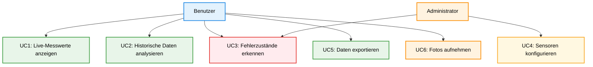

# 3 Anforderungen

## 3.0 Stakeholder & Use-Cases

### Stakeholder

Das System richtet sich primär an:
- **Forscher/Wissenschaftler:** Benötigen verlässliche Messwerte für Experimente
- **Hobbygärtner/Enthusiasten:** Möchten ihre Hydroponik-Anlagen überwachen
- **Studierende:** Nutzen das System für Lehrprojekte und Abschlussarbeiten

### Use-Cases

- **UC1:** Live-Überblick über aktuelle Messwerte aller Sensor-Nodes
- **UC2:** Historische Datenanalyse (Trends, Zeitreihen)
- **UC3:** Erkennung von Fehlerzuständen (Node offline, Sensor defekt)
- **UC4:** Konfiguration von Sensoren und Kalibrierung
- **UC5:** Export von Messdaten für externe Analysen (CSV)
- **UC6:** Visuelle Dokumentation des Pflanzenwachstums (Fotos)

**Abbildung 3.1: Use-Case-Diagramm des SensorHUB-Systems**

Das Use-Case-Diagramm zeigt die Hauptakteure (**Benutzer** und **Administrator**) sowie die wichtigsten Anwendungsfälle. Benutzer können Live-Daten anzeigen, historische Daten analysieren, Daten exportieren und Fotos aufnehmen. Administratoren konfigurieren Sensoren und überwachen den Systemstatus.

---

Die detaillierten Anforderungen sind in separate Dateien ausgelagert:

- [3.1 Kundenanforderungen (Funktionale Anforderungen)](./03-KUNDENANFORDERUNGEN.md)
- [3.2 Technische Anforderungen](./03-TECHNISCHE-ANFORDERUNGEN.md)

---

## 3.3 Nicht-funktionale Anforderungen

### Zuverlässigkeit

- **NFR-01:** Das System soll bei kurzzeitigen Netzwerkausfällen weiterarbeiten.  
  **Fit Criterion:** Erfüllt, wenn Datenerfassung und -speicherung nach einer Unterbrechung ohne manuelles Eingreifen fortgesetzt werden.
- **NFR-02:** Node-Ausfälle sollen erkannt und gemeldet werden.  
  **Fit Criterion:** Erfüllt, wenn ein offline-Status innerhalb eines definierten Prüfintervalls sichtbar ist.
- **NFR-03:** Messdaten dürfen nicht verloren gehen.  
  **Fit Criterion:** Erfüllt, wenn jeder erfasste Messwert persistent gespeichert wird.

### Wartbarkeit

- **NFR-04:** Der Code soll modular strukturiert sein.  
  **Fit Criterion:** Erfüllt, wenn Backend, Firmware und UI in getrennten Modulen/Komponenten organisiert sind.
- **NFR-05:** Zentrale Komponenten sollen mit Unit-Tests abgedeckt sein.  
  **Fit Criterion:** Erfüllt, wenn für Kernfunktionen automatisierte Tests definiert sind.
- **NFR-06:** Das System soll gut dokumentiert sein (API, Architektur, Deployment).  
  **Fit Criterion:** Erfüllt, wenn entsprechende Dokumente vorhanden und nachvollziehbar sind.

### Performance

- **NFR-07:** Das Backend soll Messwerte zeitnah verarbeiten.  
  **Fit Criterion:** Erfüllt, wenn die Verarbeitung innerhalb eines vorab definierten Zeitfensters erfolgt.
- **NFR-08:** Die UI soll auch bei größeren Datenmengen flüssig bleiben.  
  **Fit Criterion:** Erfüllt, wenn die Darstellung historischer Daten ohne wahrnehmbare Verzögerungen möglich ist.
- **NFR-09:** Mehrere Nodes sollen gleichzeitig Daten senden können ohne Blockierung.  
  **Fit Criterion:** Erfüllt, wenn parallele Messwertübermittlung mehrerer Nodes funktioniert.

### Sicherheit

- **NFR-10:** Sensible Konfigurationsdaten sollen nicht im Quellcode hinterlegt sein.  
  **Fit Criterion:** Erfüllt, wenn sensible Werte ausschließlich über Konfiguration/Umgebung geladen werden.
- **NFR-11:** Eingaben an die API sollen validiert werden.  
  **Fit Criterion:** Erfüllt, wenn fehlerhafte oder unvollständige Requests abgewiesen werden.

## 3.4 Randbedingungen

### Hardware/Netzwerk/Deployment

- **RB-01:** Das System läuft lokal ohne externe Cloud-Abhängigkeit.
- **RB-02:** Die Sensor-Nodes basieren auf Raspberry Pi Pico (RP2040).
- **RB-03:** Das Backend läuft auf einem Standard-PC; Windows wird unterstützt.
- **RB-04:** Die Nodes kommunizieren mit dem Hub über USB-Serial.
- **RB-05:** Das System benötigt keine Internetverbindung für den Betrieb.

## 3.5 Vorgehen zur Verifikation

In den Kapiteln zu Kunden- und technischen Anforderungen werden Fit Criteria definiert, die als prüfbare Kriterien dienen. Die eigentliche Verifikation und Bewertung erfolgt später im Kapitel **Test & Evaluation**. Falls erforderliche Hardware zum Zeitpunkt der Durchführung nicht verfügbar ist, wird die Verifikation nachgeholt oder als im Rahmen der Arbeit nicht verifizierbar dokumentiert. Dadurch bleibt die Trennung zwischen Anforderungsdefinition und späterer Bewertung gewahrt.
