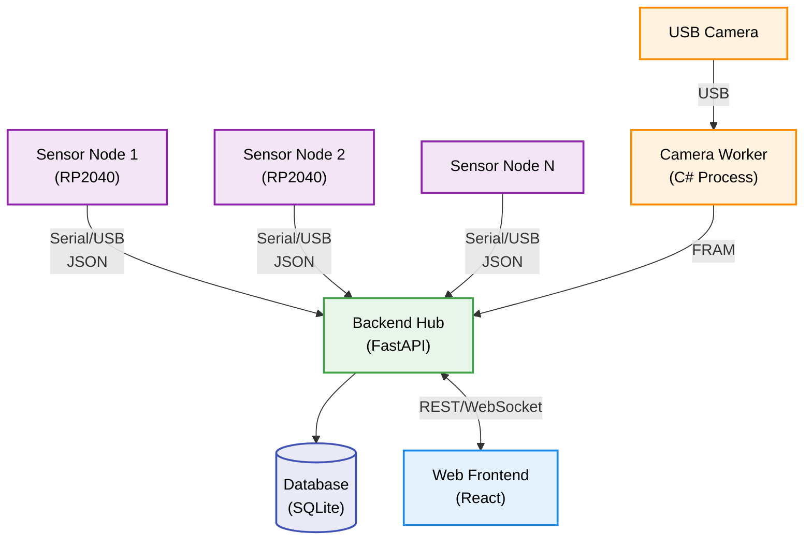
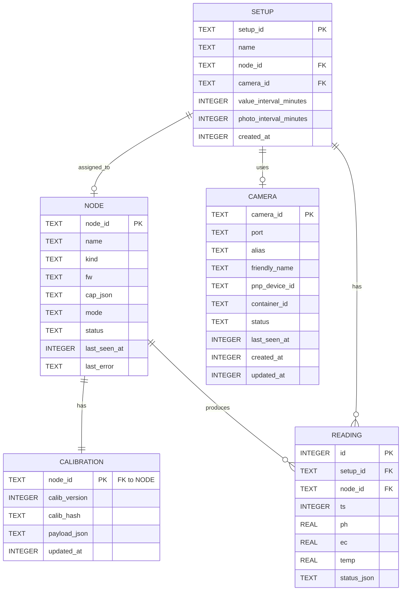
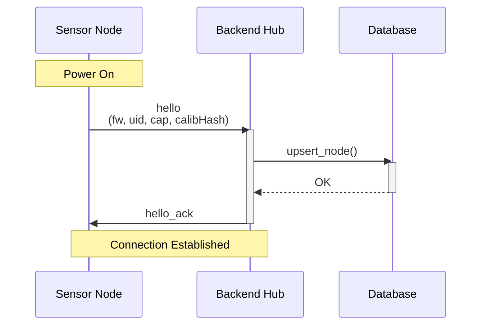
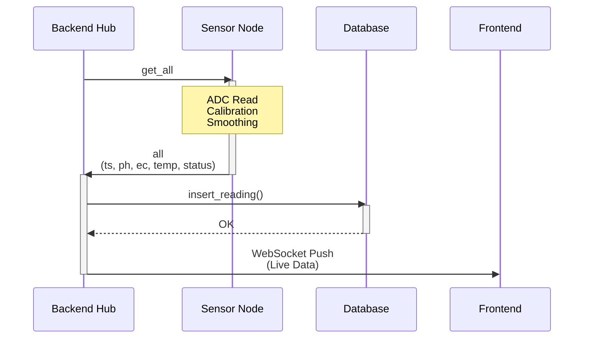
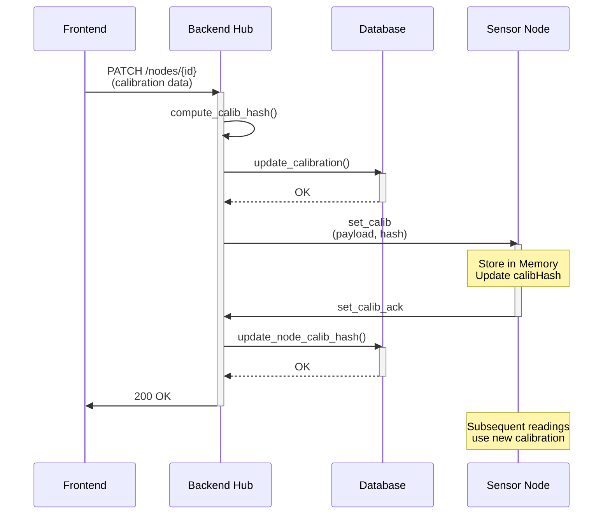

# 4 Konzeption und Entwurf

Dieses Kapitel beschreibt die architektonischen Entscheidungen, das Datenmodell und die Kommunikationsprotokolle des SensorHUB-Systems.

## 4.1 Systemarchitektur

### 4.1.1 Architekturübersicht

Das System folgt einer **Node-Hub-Architektur**:

- **Sensor-Nodes**: Erfassen Messwerte lokal (pH, EC, Temperatur)
- **Hub (Backend)**: Zentrale Koordinations- und Datenverwaltungsinstanz
- **Frontend**: Web-basierte Benutzeroberfläche

Evidence: sensornode-firmware/src/main.cpp :: readPhRaw/readEcRaw/readTempC :: Sensorwerte lokal; Evidence: sensorhub-backend/app/main.py :: FastAPI app :: Hub-Backend; Evidence: sensorhub-frontend/src/services/ws.ts :: LiveWsClient :: Web-Frontend.

**Abbildung 4.1: Systemarchitektur-Übersicht**



Die Systemarchitektur zeigt die Node-Hub-Architektur: Mehrere Sensor-Nodes kommunizieren über Serial/USB mit dem Backend-Hub. Dieser speichert Daten in SQLite und stellt sie dem Web-Frontend über REST/WebSocket zur Verfügung. USB-Kameras werden über einen separaten C#-Worker-Prozess verwaltet.

### 4.1.2 Komponenten

#### Sensor-Node (Firmware)
- **Plattform**: Raspberry Pi Pico (RP2040)
- **Kommunikation**: Serielles JSON-Protokoll über USB
- **Funktionen**: Sensor-Auslesen, Kalibrierung, Smoothing, Debug-Modus
Evidence: sensornode-firmware/src/main.cpp :: FW_VERSION/sendJson/computeSmoothed/handleSetMode :: RP2040-Firmware, Serial JSON, Smoothing, Debug-Modus.

#### Hub (Backend)
- **Framework**: FastAPI (Python)
- **Datenbank**: SQLite
- **Funktionen**: 
  - Automatische Node-Discovery
  - Automatische Kamera-Discovery
  - Zyklische Messwerterfassung
  - REST API + WebSocket
  - Foto-Capture und -Speicherung
Evidence: sensorhub-backend/app/main.py :: FastAPI app + /api/live :: REST/WS; Evidence: sensorhub-backend/app/db.py :: init_db/readings :: SQLite; Evidence: sensorhub-backend/app/nodes.py :: node_discovery_loop :: Node-Discovery; Evidence: sensorhub-backend/app/camera_devices.py :: camera_discovery_loop :: Kamera-Discovery; Evidence: sensorhub-backend/app/realtime_updates.py :: readings_capture_loop :: Zyklische Messungen; Evidence: sensorhub-backend/app/camera_streaming.py :: capture_photo_now/photo_capture_loop :: Foto-Capture.

#### Frontend
- **Framework**: React (TypeScript)
- **Funktionen**: Live-Visualisierung, historische Daten, Setup-Verwaltung
Evidence: sensorhub-frontend/src/services/ws.ts :: LiveWsClient :: Live-Visualisierung; Evidence: sensorhub-backend/app/api/setups.py :: get_history :: Historische Daten.

### 4.1.3 Designentscheidungen

#### Warum Raspberry Pi Pico statt ESP32?
- **USB-Serial vs. WLAN**: Einfachere, zuverlässigere Kommunikation
- **Kosten**: Günstiger (~4€ vs. ~8€)
- **Stromverbrauch**: Geringer bei reiner Serial-Kommunikation
- **Erweiterbarkeit**: WLAN-Upgrade möglich durch **Pico W**, ohne Wechsel der MCU-Plattform
**Alternativen (realistisch):**
- **ESP32 mit WLAN/HTTP**: integriertes WLAN, MCU-Ökosystem mit IoT-Fokus

**Trade-Off**: Keine Wireless-Fähigkeit im aktuellen Prototyp -> Nodes müssen per USB verbunden sein

**Evaluationsmatrix (1=schlecht, 5=sehr gut):**

| Kriterium | Pico (USB) | ESP32 (WLAN) |
|-----------|------------|--------------|
| Integrationsaufwand | 5 | 3 |
| Zuverlässigkeit (Laborbetrieb) | 5 | 3 |
| Kosten | 5 | 3 |
| Energiebedarf | 5 | 3 |
| Funk/Remote-Fähigkeit | 1 | 5 |
| Reife der Codebasis | 5 | 2 |

**Ergebnis:** Pico (USB) ist für den aktuellen Prototypen am robustesten und erfüllt die definierten technischen Anforderungen (insb. TR-05, TR-09).
Evidence: sensornode-firmware/src/main.cpp :: FW_VERSION :: Implementierung basiert auf Raspberry Pi Pico.

#### Warum lokales System ohne Cloud?
- **Datenhoheit**: Alle Messdaten bleiben lokal
- **Keine Abhängigkeit**: Funktioniert ohne Internetverbindung
- **Latenz**: Sofortige Anzeige ohne Cloud-Roundtrip
**Alternativen (realistisch):**
- **Direct-to-Cloud:** MQTT -> Cloud-Broker
- **Hybrid:** lokaler Hub mit optionaler Cloud-Synchronisation

**Trade-Off**: Kein Remote-Access möglich (ohne VPN/Port-Forwarding)

**Evaluationsmatrix (1=schlecht, 5=sehr gut):**

| Kriterium | Lokal (Hub) | Cloud-First | Hybrid |
|-----------|------------|------------|--------|
| Offline-Betrieb | 5 | 1 | 4 |
| Datenschutz/Datenhoheit | 5 | 2 | 4 |
| Komplexität | 4 | 2 | 2 |
| Kosten (laufend) | 5 | 2 | 3 |
| Remote-Zugriff | 2 | 5 | 4 |

**Ergebnis:** Lokal (Hub) ist für Labor-/Heimnetz-Szenarien am geeignetsten.
Evidence: sensorhub-backend/app/db.py :: DB_PATH :: Lokale Datenhaltung ohne Cloud-Endpoint.

#### Warum SQLite statt PostgreSQL?
- **Embedded**: Keine separate Datenbankinstanz nötig
- **Einfaches Deployment**: Single-File Datenbank
- **Ausreichend**: Für 1-10 Nodes und 10.000+ Messwerte/Tag
**Alternativen (realistisch):**
- **PostgreSQL + TimescaleDB:** externe DB-Instanz mit Time-Series-Features
- **InfluxDB:** spezialisierte Time-Series-Datenbank

**Trade-Off**: Keine optimierten Time-Series-Queries (aber mit Index ausreichend)

**Evaluationsmatrix (1=schlecht, 5=sehr gut):**

| Kriterium | SQLite | PostgreSQL/TimescaleDB | InfluxDB |
|-----------|--------|-------------------------|----------|
| Setup/Deployment | 5 | 2 | 2 |
| Betrieb/Wartung | 5 | 2 | 3 |
| Skalierbarkeit | 2 | 5 | 5 |
| Time-Series-Queries | 3 | 5 | 5 |
| Overhead für Prototyp | 5 | 2 | 2 |

**Ergebnis:** SQLite ist für einen lokalen Prototypen mit wenigen Nodes der pragmatische Standard.
Evidence: sensorhub-backend/app/db.py :: init_db :: SQLite als DB-Backend.

#### Warum Custom PCB statt Off-the-Shelf-Komponenten?
- **Reproduzierbarkeit**: PCB kann mehrfach gefertigt werden
- **Robustheit**: Verlötete Verbindungen vs. Steckverbindungen
- **Kompaktheit**: Alle Komponenten auf einer Platine

**Alternativen (realistisch):**
- **Off-the-Shelf Module + Breadboard/Proto-Board**
- **Entwicklerboards + Verdrahtung (Jumper-Harness)**

**Trade-Off**: Initiale Entwicklungszeit (Design + Tests) höhere Einstiegshürde

**Evaluationsmatrix (1=schlecht, 5=sehr gut):**

| Kriterium | Custom PCB | Module/Proto | Dev-Boards |
|-----------|------------|--------------|------------|
| Reproduzierbarkeit | 5 | 2 | 3 |
| Robustheit | 5 | 2 | 3 |
| Entwicklungsaufwand | 2 | 5 | 4 |
| Kosten (pro Stück) | 4 | 3 | 2 |
| Änderbarkeit/Iterationen | 3 | 5 | 4 |

**Ergebnis:** Custom PCB ist für eine stabile, reproduzierbare Lösung langfristig sinnvoll, Prototyping geht schneller mit Modulen/Dev-Boards.
Evidence: NONE -> [HARDWARE-NOT-AVAILABLE-YET]

---

## 4.2 Datenmodell

### 4.2.1 Entity-Relationship-Diagramm

**Abbildung 4.2: Entity-Relationship-Diagramm des Datenmodells**



Das ER-Diagramm zeigt die fünf Hauptentitäten des Systems und ihre Beziehungen. Ein Setup (Versuchsaufbau) kann einen Node und eine Kamera zugeordnet haben. Readings (Messwerte) werden von Nodes produziert und Setups zugeordnet. Jeder Node besitzt eine Kalibrierung.

### 4.2.2 Datenbank-Schema

#### Setup
Repräsentiert eine hydroponische Anlage.
Evidence: sensorhub-backend/app/db.py :: setups table :: Schema für Setups.

| Feld | Typ | Beschreibung |
|------|-----|--------------|
| `setup_id` | TEXT | Eindeutige UUID |
| `name` | TEXT | Anzeigename |
| `node_id` | TEXT | Zugeordnete Node (optional) |
| `camera_id` | TEXT | Zugeordnete Kamera (optional) |
| `value_interval_minutes` | INTEGER | Messintervall |
| `photo_interval_minutes` | INTEGER | Foto-Intervall |
| `created_at` | INTEGER | Erstellungszeitpunkt (Unix-ms) |

#### Node
Repräsentiert einen physischen Sensorknoten.
Evidence: sensorhub-backend/app/db.py :: nodes table :: Schema für Nodes.

| Feld | Typ | Beschreibung |
|------|-----|--------------|
| `node_id` | TEXT | Hardware-UID (aus Flash) |
| `name` | TEXT | Alias (optional) |
| `kind` | TEXT | Node-Typ (`real`, `virtual`) |
| `fw` | TEXT | Firmware-Version |
| `cap_json` | TEXT | Capabilities (JSON) |
| `mode` | TEXT | `real` oder `debug` |
| `status` | TEXT | `online`, `offline`, `error` |
| `last_seen_at` | INTEGER | Letzter Kontakt (Unix-ms) |
| `last_error` | TEXT | Letzte Fehlermeldung |

#### Reading
Einzelner Messwert.
Evidence: sensorhub-backend/app/db.py :: readings table :: Schema für Readings.

| Feld | Typ | Beschreibung |
|------|-----|--------------|
| `id` | INTEGER | Auto-Increment |
| `setup_id` | TEXT | Zugehöriges Setup |
| `node_id` | TEXT | Sensor-Node |
| `ts` | INTEGER | Zeitstempel (Unix-ms) |
| `ph` | REAL | pH-Wert |
| `ec` | REAL | Leitfähigkeit (mS/cm) |
| `temp` | REAL | Temperatur (°C) |
| `status_json` | TEXT | Status-Array (JSON) |

#### Calibration
Kalibrierungsdaten für Nodes.
Evidence: sensorhub-backend/app/db.py :: calibration table :: Schema für Kalibrierung.

| Feld | Typ | Beschreibung |
|------|-----|--------------|
| `node_id` | TEXT | Node-ID (Primary Key) |
| `calib_version` | INTEGER | Kalibrierungsversion |
| `calib_hash` | TEXT | Hash der Kalibrierungsdaten |
| `payload_json` | TEXT | Vollständige Kalibrierdaten (JSON) |
| `updated_at` | INTEGER | Letztes Update (Unix-ms) |

**Kalibrierungsdaten-Format (JSON):**

```json
{
  "ph": {
    "points": [
      { "raw": 0.0, "val": 0.0 },
      { "raw": 1.65, "val": 7.0 },
      { "raw": 3.3, "val": 14.0 }
    ]
  },
  "ec": {
    "points": [
      { "raw": 0.0, "val": 0.0 },
      { "raw": 3.3, "val": 5.0 }
    ]
  }
}
```
Evidence: sensorhub-backend/app/nodes.py :: sync_calibration :: Payload-Format wird an Node gesendet.

#### Camera
Kamera-Registrierungen und Statusinformationen.

| Feld | Typ | Beschreibung |
|------|-----|--------------|
| `camera_id` | TEXT | Kamera-ID (intern) |
| `port` | TEXT | USB-Port (falls vorhanden) |
| `alias` | TEXT | Anzeigename |
| `friendly_name` | TEXT | Systemname |
| `pnp_device_id` | TEXT | PnP Device ID |
| `container_id` | TEXT | Container-ID |
| `status` | TEXT | `online`/`offline` |
| `last_seen_at` | INTEGER | Letzter Kontakt (Unix-ms) |
| `created_at` | INTEGER | Erstellungszeitpunkt |
| `updated_at` | INTEGER | Letztes Update |
Evidence: sensorhub-backend/app/db.py :: cameras table :: Schema für Kameras.

---

## 4.3 Kommunikationsprotokolle

### 4.3.1 Node ↔ Hub Protokoll

**Medium**: Serielles USB (JSON-Nachrichten, newline-delimited)

Evidence: sensornode-firmware/src/main.cpp :: sendJson/handleMessage :: JSON-Line-Protokoll über Serial.

**Abbildung 4.3a: Node Discovery und Registration**



Die Discovery-Phase: Die Node sendet beim Start eine `hello`-Nachricht mit ihrer Firmware-Version, Hardware-UID und Capabilities. Der Hub registriert die Node in der Datenbank und bestätigt mit `hello_ack`.

**Abbildung 4.3b: Messwert-Erfassung (Reading Capture)**



Der Reading-Capture-Zyklus: Der Hub fordert Messwerte an (`get_all`), die Node liest Sensoren aus und wendet Kalibrierung/Glättung an. Die Messwerte werden in der Datenbank gespeichert und via WebSocket an das Frontend gesendet.

#### Nachrichtentypen

**1. Hello (Node → Hub)**

Node kündigt sich beim Start an:

```json
{
  "t": "hello",
  "raw": "probe",
  "fw": "pico-0.1.0",
  "uid": "e6614103e7696a25",
  "cap": {
    "ph": true,
    "ec": true,
    "temp": true,
    "debug": true,
    "calib": true,
    "pins": {
      "ph": "adc2",
      "ec": "adc0",
      "temp": "gpio17"
    }
  },
  "calibHash": "default"
}
```
Evidence: sensornode-firmware/src/main.cpp :: sendHello :: Hello-Payload.

**2. Hello Acknowledgement (Hub → Node)**

Hub bestätigt Node-Registration:

```json
{
  "t": "hello_ack",
  "fw": "pico-0.1.0",
  "uid": "e6614103e7696a25",
  "cap": {...},
  "calibHash": "default"
}
```
Evidence: sensorhub-backend/app/nodes.py :: _send_hello_ack :: Hello-ACK-Payload.

**3. Get All (Hub → Node)**

Hub fordert aktuelle Messwerte an:

```json
{
  "t": "get_all"
}
```

**Response (Node → Hub):**

```json
{
  "t": "all",
  "raw": "{...request...}",
  "ts": 1234567890,
  "mode": "real",
  "status": ["ok"],
  "ph": 6.8,
  "ec": 1.2,
  "temp": 21.5
}
```
Evidence: sensornode-firmware/src/main.cpp :: handleGetAll :: Messwert-Response.

**4. Set Mode (Hub → Node)**

Wechsel zwischen Real- und Debug-Modus:

```json
{
  "t": "set_mode",
  "mode": "debug"
}
```
Evidence: sensorhub-backend/app/api/nodes.py :: post_node_command :: set_mode wird gesendet.

**5. Set Values (Hub → Node, nur Debug-Modus)**

Manuelle Wert-Setzung:

```json
{
  "t": "set_values",
  "ph": 7.0,
  "ec": 1.5,
  "temp": 22.0
}
```
Evidence: sensorhub-backend/app/api/nodes.py :: post_node_command :: set_values wird gesendet.

**6. Set Calibration (Hub → Node)**

Neue Kalibrierungsdaten übertragen:

```json
{
  "t": "set_calib",
  "payload": {
    "ph": {
      "points": [...]
    },
    "ec": {
      "points": [...]
    },
    "calibHash": "abc123"
  }
}
```

**Response:**

```json
{
  "t": "set_calib_ack",
  "raw": "{...request...}"
}
```

Evidence: sensorhub-backend/app/nodes.py :: sync_calibration :: set_calib/ack-Handshake.

**Abbildung 4.4: Kalibrierungs-Synchronisation**



Die Kalibrierungs-Synchronisation: Der Benutzer sendet neue Kalibrierdaten über das Frontend. Der Hub berechnet einen Hash, speichert die Daten in der Datenbank und überträgt sie an die Node. Die Node bestätigt den Empfang und wendet die Kalibrierung auf alle nachfolgenden Messungen an.

### 4.3.2 Hub ↔ Frontend Protokoll

#### REST API

**Base URL**: `http://localhost:8000/api`

| Endpoint | Method | Beschreibung |
|----------|--------|--------------|
| `/setups` | GET | Liste aller Setups |
| `/setups` | POST | Neues Setup erstellen |
| `/setups/{id}` | PATCH | Setup aktualisieren |
| `/setups/{id}` | DELETE | Setup löschen |
| `/setups/{id}/reading` | GET | Aktuellen Messwert abrufen |
| `/setups/{id}/capture-reading` | POST | Messwert erfassen & speichern |
| `/setups/{id}/capture-photo` | POST | Foto erfassen & speichern |
| `/setups/{id}/history` | GET | Historische Daten |
| `/setups/{id}/camera/stream` | GET | MJPEG-Stream |
| `/setups/{id}/camera/snapshot` | GET | Einzelbild (JPEG) |
| `/nodes` | GET | Liste aller Nodes |
| `/nodes/ports` | GET | Liste verfügbarer Serial-Ports |
| `/nodes/{id}` | PATCH | Node-Alias ändern |
| `/nodes/{id}` | DELETE | Node entfernen |
| `/nodes/{id}/command` | POST | Kommando an Node senden |
| `/cameras/devices` | GET | Kamera-Geräte (Discovery) |
| `/cameras/{id}` | PATCH | Kamera-Alias ändern |
| `/cameras/{id}` | DELETE | Kamera entfernen |
| `/admin/health` | GET | System-Health-Status |
| `/admin/reset` | POST | System-Reset (Token erforderlich) |
| `/export/all` | GET | Alle Daten als ZIP exportieren |
Evidence: sensorhub-backend/app/api/setups.py :: router endpoints :: Setup-API; Evidence: sensorhub-backend/app/api/nodes.py :: router endpoints :: Node-API; Evidence: sensorhub-backend/app/api/cameras.py :: list_camera_devices_route/patch/delete :: Kamera-API; Evidence: sensorhub-backend/app/api/admin.py :: get_health/reset_db :: Admin-API; Evidence: sensorhub-backend/app/main.py :: camera_stream/camera_snapshot :: Kamera-Stream/Snapshot.

#### WebSocket

**Endpoint**: `ws://localhost:8000/api/live`

**Subscribe zu Setup-Updates:**

```json
{
  "t": "sub",
  "setupId": "setup-uuid"
}
```

**Live-Reading-Nachricht:**

```json
{
  "t": "reading",
  "setupId": "setup-uuid",
  "ts": 1234567890,
  "ph": 6.8,
  "ec": 1.2,
  "temp": 21.5,
  "status": ["ok"]
}
```
Evidence: sensorhub-backend/app/realtime_updates.py :: _build_reading_payload :: Reading-Payload.

**Weitere Server-Nachrichten:**

```json
{
  "t": "cameraDevices",
  "devices": [...]
}
```

```json
{
  "t": "reset",
  "reason": "db-reset"
}
```
Evidence: sensorhub-backend/app/camera_devices.py :: broadcast_camera_devices :: cameraDevices-Message; Evidence: sensorhub-backend/app/realtime_updates.py :: broadcast_system_reset :: reset-Message.

---

## 4.4 Sicherheitskonzept

### CSRF-Schutz

- **Token-basiert**: `X-CSRF-Token` wird geprüft, wenn kein Origin-Header vorhanden ist
- **Origin-Check**: Nur vertrauenswürdige Origins erlaubt
Evidence: sensorhub-backend/app/main.py :: csrf_protect :: Token- und Origin-Validierung.

### Admin-Funktionen

- **Reset-Endpoint**: Erfordert `X-Reset-Token` Header
- **Token aus Environment-Variable**: `ADMIN_RESET_TOKEN`
Evidence: sensorhub-backend/app/api/admin.py :: reset_db :: Reset-Endpoint mit Token.

### Limitierungen

- ⚠️ **Keine Benutzer-Authentifizierung**: System ist für lokales Netzwerk gedacht
- ⚠️ **Keine Verschlüsselung**: HTTP (nicht HTTPS)
- ⚠️ **Keine Autorisierung**: Alle Clients haben vollen Zugriff
Evidence: sensorhub-backend/app/main.py :: FastAPI app :: Keine Auth-Middleware; HTTP/WS ohne TLS-Konfiguration im Code.
