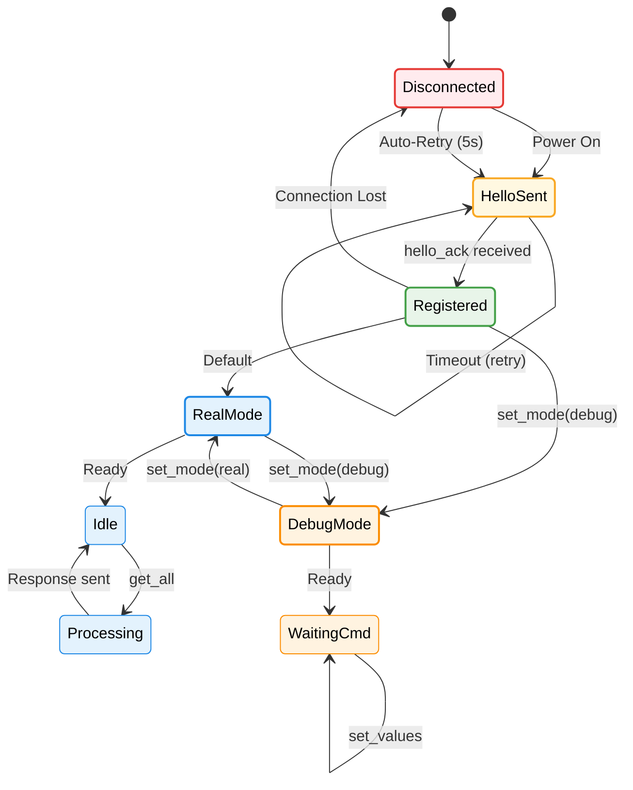
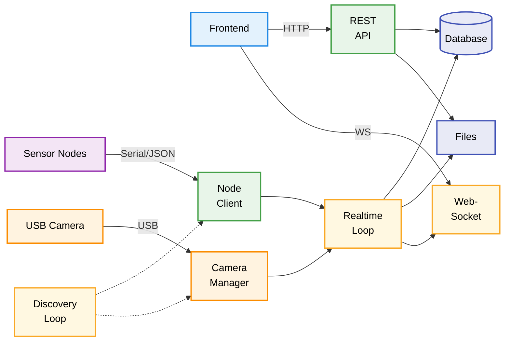

# 5 Implementierung

Dieses Kapitel beschreibt die konkrete Umsetzung des Systems, getrennt nach Hardwarestatus und Softwarekomponenten.

## 5.1 Hardware-Entwicklung

Die Hardware befindet sich im Prototypenstadium; die physische PCB ist noch nicht verfügbar. [HARDWARE-NOT-AVAILABLE-YET]

Die Software ist für Sensor-Nodes auf Basis des Raspberry Pi Pico (RP2040) ausgelegt. Evidence: sensornode-firmware/src/main.cpp :: FW_VERSION :: Firmware-Version "pico-0.1.0".

## 5.2 Firmware-Implementierung (Sensor-Node)

Die Firmware liest pH-, EC- und Temperaturwerte, wendet Kalibrierung an und stellt Messwerte über ein JSON-Line-Protokoll zur Verfügung. Evidence: sensornode-firmware/src/main.cpp :: handleGetAll/sendJson :: Messwerte werden per Serial JSON ausgegeben.

**ADC und Sensorpins (RP2040):** pH an GPIO28 (ADC2), EC an GPIO26 (ADC0), Temperatur an GPIO17 (OneWire). Evidence: sensornode-firmware/src/main.cpp :: PH_PIN/EC_PIN/TEMP_PIN :: Pin-Zuordnung.

**Kalibrierung:** pH 3-Punkt, EC 2-Punkt, jeweils stückweise linear. Evidence: sensornode-firmware/src/main.cpp :: applyPhCalibration/applyEcCalibration :: Kalibrierlogik.

**Smoothing:** Mittelung über ein Zeitfenster mit ringförmigem Sample-Buffer. Evidence: sensornode-firmware/src/main.cpp :: computeSmoothed :: Glättungsfunktion.

**Auto-Discovery:** Die Node sendet `hello`-Nachrichten bei Verbindungsverlust. Evidence: sensornode-firmware/src/main.cpp :: HELLO_RETRY_INTERVAL_MS/sendHello :: Hello-Retry.

**Debug-Modus:** Simulierte Werte können per `set_mode` aktiviert werden. Evidence: sensornode-firmware/src/main.cpp :: handleSetMode/updateDebugValues :: Debug-Logik.

**Abbildung 5.1: Node-Zustandsautomat (vereinfacht)**

Der Node-Zustandsautomat zeigt die Hauptzustände: **Disconnected** (rot) → **HelloSent** (gelb) → **Registered** (grün) → **RealMode** (blau) oder **DebugMode** (orange). Im RealMode werden Sensormessungen durchgeführt, im DebugMode können Testwerte gesetzt werden.

## 5.3 Backend-Implementierung

Das Backend ist eine FastAPI-Anwendung mit SQLite-Persistenz, Hintergrund-Loops und REST/WS-Schnittstellen. Evidence: sensorhub-backend/app/main.py :: FastAPI app + on_startup :: App-Setup und Loop-Start; Evidence: sensorhub-backend/app/db.py :: init_db :: SQLite-Initialisierung.

**Node-Discovery:** Serieller Port-Scan identifiziert RP2040-Devices und führt einen Hello-Handshake aus. Evidence: sensorhub-backend/app/nodes.py :: node_discovery_loop/_handshake :: Discovery- und Handshake-Logik.

**Readings-Capture:** Periodische Erfassung nach Setup-Intervallen, Speicherung in SQLite. Evidence: sensorhub-backend/app/realtime_updates.py :: readings_capture_loop :: Intervall-Capture.

**WebSocket Live-Updates:** Pro Setup wird ein Polling-Task gestartet, der Live-Readings sendet. Evidence: sensorhub-backend/app/realtime_updates.py :: LiveManager._poll_setup :: Live-Streaming.

**Abbildung 5.2: Backend-Datenfluss (vereinfacht)**

Der Backend-Datenfluss zeigt die Hauptkomponenten: **Discovery Loop** (gelb) erkennt neue Nodes/Kameras. **Node Client** (grün) kommuniziert mit Sensor-Nodes. **Realtime Loop** (gelb) erfasst Messwerte und pusht sie via **WebSocket**. Die **REST API** (grün) ermöglicht Zugriff auf historische Daten aus der **Database** (indigo).

## 5.4 Frontend-Implementierung

Die Web-UI basiert auf React/TypeScript und nutzt einen WebSocket-Client für Live-Updates. Evidence: sensorhub-frontend/src/services/ws.ts :: LiveWsClient :: WebSocket-Client mit Reconnect.

## 5.5 Kamera-Integration

Die Kamera-Integration erfolgt über einen Windows-C#-Worker, der JPEG-Frames im FRAM-Binärprotokoll an den Hub streamt. Evidence: sensorhub-backend/worker/Program.cs :: WriteFrame :: FRAM-Header + JPEG-Payload; Evidence: sensorhub-backend/app/camera_worker_manager.py :: _read_worker_frame_bytes :: FRAM-Parsing im Backend.

**Foto-Capture:** Das Backend speichert Fotos zyklisch oder per manueller Auslösung. Evidence: sensorhub-backend/app/camera_streaming.py :: photo_capture_loop/capture_photo_now :: Fotoaufnahme.

## 5.6 Fehlerbehandlung & Logging

Backend-Events werden strukturiert geloggt (z.B. Scan- und Fehlerereignisse). Evidence: sensorhub-backend/app/utils/logging.py :: log_event :: JSON-Logeinträge.

Nodes werden bei fehlendem Kontakt als offline markiert. Evidence: sensorhub-backend/app/nodes.py :: mark_nodes_offline :: Offline-Markierung.
