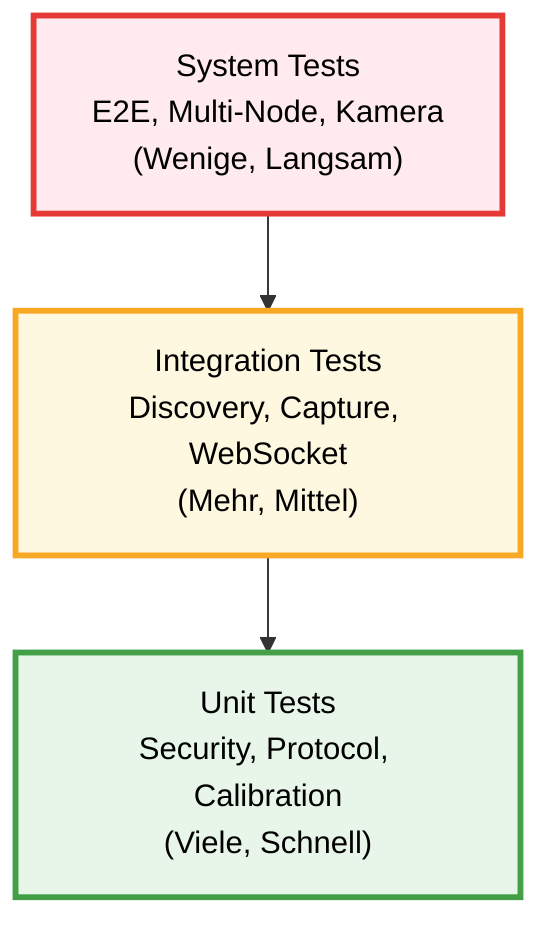

# 6 Test und Evaluation

Formale Tests wurden bisher nicht durchgeführt. [NOT-TESTED-YET]

## 6.1 Teststrategie

### 6.1.1 Testebenen

| Ebene | Fokus | Werkzeuge |
|-------|-------|-----------|
| **Unit-Tests** | Einzelne Funktionen/Klassen | pytest |
| **Integration-Tests** | Zusammenspiel mehrerer Komponenten | pytest, manuell |
| **System-Tests** | End-to-End Funktionalität | Manuell |

Evidence: sensorhub-backend/tests/ :: Testdateien :: Teststruktur vorhanden, Ausführung ausstehend.

**Abbildung 6.1: Test-Strategie-Pyramide**

Die Test-Pyramide zeigt die drei Testebenen: **Unit Tests** (grün) bilden die Basis mit vielen, schnellen Tests für einzelne Funktionen. **Integration Tests** (gelb) prüfen das Zusammenspiel von Komponenten. **System Tests** (rot) validieren End-to-End-Szenarien. Status: Teststruktur vorhanden, Ausführung ausstehend [NOT-TESTED-YET].

### 6.1.2 Testumgebung

**Hardware:** RP2040-Node(s), Sensorik, USB-Kamera, Hub-PC. [HARDWARE-NOT-AVAILABLE-YET]

**Software:** Python, Node.js, Browser, pytest. Evidence: sensorhub-backend/tests/ :: Testdateien :: pytest-Testbasis vorhanden.

---

## 6.2 Unit-Tests

**Backend:** Sicherheitslogik, Kamera-Worker-Manager, Readings-Capture. [NOT-TESTED-YET] Evidence: sensorhub-backend/tests/ :: test_security/test_camera_worker_manager/test_readings_capture_loop :: Testmodule vorhanden.

**Firmware:** ADC, Kalibrierung, Smoothing, Protokoll. [NOT-TESTED-YET] Evidence: sensornode-firmware/src/main.cpp :: readPhRaw/applyPhCalibration/computeSmoothed/handleMessage :: Zielbereiche.

---

## 6.3 Integrations-Tests

- **Node-Discovery:** Hello-Handshake und Registrierung. [NOT-TESTED-YET] Evidence: sensorhub-backend/app/nodes.py :: _handshake/upsert_node :: Discovery-Flow.
- **Messwert-Erfassung:** `fetch_setup_reading` + SQLite-Speicherung. [NOT-TESTED-YET] Evidence: sensorhub-backend/app/api/setups.py :: capture_reading :: Persistenz-Flow.
- **Live-Updates:** `/api/live` WebSocket. [NOT-TESTED-YET] Evidence: sensorhub-backend/app/main.py :: /api/live :: WebSocket-Endpunkt.

---

## 6.4 System-Tests

- **E2E-Flow:** Setup anlegen → Node zuweisen → Messwerte → Historie. [NOT-TESTED-YET] Evidence: sensorhub-backend/app/api/setups.py :: post_setup/patch_setup/get_history :: Setup-Flow.
- **Multi-Node:** Zwei Nodes parallel, getrennte Setups. [NOT-TESTED-YET] Evidence: sensorhub-backend/app/nodes.py :: NODE_CLIENTS :: Multi-Node-Struktur.
- **Kamera:** Discovery, Snapshot, Intervall-Fotos. [NOT-TESTED-YET] Evidence: sensorhub-backend/app/camera_devices.py :: camera_discovery_loop :: Discovery; Evidence: sensorhub-backend/app/camera_streaming.py :: snapshot_camera/photo_capture_loop :: Snapshot/Intervalle.
- **Export:** ZIP/CSV-Format. [NOT-TESTED-YET] Evidence: sensorhub-backend/app/api/setups.py :: export_all :: Export-Endpoint.

---

## 6.5 Performance-Tests

- **API-Latenzen:** `GET /setups`, `GET /setups/{id}/history`, `POST /setups/{id}/capture-reading`. [NOT-TESTED-YET] Evidence: sensorhub-backend/app/api/setups.py :: router endpoints :: Ziel-Endpoints.
- **DB-Query:** `readings`-Abfragen mit Limit. [NOT-TESTED-YET] Evidence: sensorhub-backend/app/db.py :: list_readings :: Query-Pfad.

---

## 6.6 Robustheitstests

- **Node-Disconnect/Recover:** Hello-Retry + Offline-Markierung. [NOT-TESTED-YET] Evidence: sensornode-firmware/src/main.cpp :: HELLO_ACK_TIMEOUT_MS :: Disconnect-Erkennung; Evidence: sensorhub-backend/app/nodes.py :: mark_nodes_offline :: Offline-Markierung.
- **Backend-Restart:** Persistenz und Reconnect-Verhalten. [NOT-TESTED-YET] Evidence: sensorhub-backend/app/main.py :: on_startup :: Backend-Startup.
- **Fehlerhafte Sensordaten:** Status-Array und Plausibilität. [NOT-TESTED-YET] Evidence: sensornode-firmware/src/main.cpp :: handleGetAll :: Status-Array im Payload.

---

## 6.7 Anforderungs-Erfüllung (vorläufig)

Die Erfüllung der Anforderungen basiert auf Implementierungsevidenz, nicht auf Testergebnissen. [NOT-TESTED-YET] Evidence: bachelorarbeit/03-KUNDENANFORDERUNGEN.md :: Übersicht :: Implementierungsstatus.

---

## 6.8 Diskussion

Die Diskussion erfolgt nach Abschluss der Tests. [NOT-TESTED-YET]

---

## 6.9 Zusammenfassung

Aktuell liegt ein implementierter Software-Prototyp vor; die Validierung ist ausstehend. [NOT-TESTED-YET] [HARDWARE-NOT-AVAILABLE-YET]
# 6 Test und Evaluation

Formale Tests wurden bisher nicht durchgeführt. [NOT-TESTED-YET]

## 6.1 Teststrategie

### 6.1.1 Testebenen

| Ebene | Fokus | Werkzeuge |
|-------|-------|-----------|
| **Unit-Tests** | Einzelne Funktionen/Klassen | pytest |
| **Integration-Tests** | Zusammenspiel mehrerer Komponenten | pytest, manuell |
| **System-Tests** | End-to-End Funktionalität | Manuell |

Evidence: sensorhub-backend/tests/ :: Testdateien :: Teststruktur vorhanden, Ausführung ausstehend.

**Abbildung 6.1: Test-Strategie-Pyramide**

Die Test-Pyramide zeigt die drei Testebenen: **Unit Tests** (grün) bilden die Basis mit vielen, schnellen Tests für einzelne Funktionen. **Integration Tests** (gelb) prüfen das Zusammenspiel von Komponenten. **System Tests** (rot) validieren End-to-End-Szenarien. Status: Teststruktur vorhanden, Ausführung ausstehend [NOT-TESTED-YET].

### 6.1.2 Testumgebung

**Hardware:** RP2040-Node(s), Sensorik, USB-Kamera, Hub-PC. [HARDWARE-NOT-AVAILABLE-YET]

**Software:** Python, Node.js, Browser, pytest. Evidence: sensorhub-backend/tests/ :: Testdateien :: pytest-Testbasis vorhanden.

---

## 6.2 Unit-Tests

**Backend:** Sicherheitslogik, Kamera-Worker-Manager, Readings-Capture. [NOT-TESTED-YET] Evidence: sensorhub-backend/tests/ :: test_security/test_camera_worker_manager/test_readings_capture_loop :: Testmodule vorhanden.

**Firmware:** ADC, Kalibrierung, Smoothing, Protokoll. [NOT-TESTED-YET] Evidence: sensornode-firmware/src/main.cpp :: readPhRaw/applyPhCalibration/computeSmoothed/handleMessage :: Zielbereiche.

---

## 6.3 Integrations-Tests

- **Node-Discovery:** Hello-Handshake und Registrierung. [NOT-TESTED-YET] Evidence: sensorhub-backend/app/nodes.py :: _handshake/upsert_node :: Discovery-Flow.
- **Messwert-Erfassung:** `fetch_setup_reading` + SQLite-Speicherung. [NOT-TESTED-YET] Evidence: sensorhub-backend/app/api/setups.py :: capture_reading :: Persistenz-Flow.
- **Live-Updates:** `/api/live` WebSocket. [NOT-TESTED-YET] Evidence: sensorhub-backend/app/main.py :: /api/live :: WebSocket-Endpunkt.

---

## 6.4 System-Tests

- **E2E-Flow:** Setup anlegen → Node zuweisen → Messwerte → Historie. [NOT-TESTED-YET] Evidence: sensorhub-backend/app/api/setups.py :: post_setup/patch_setup/get_history :: Setup-Flow.
- **Multi-Node:** Zwei Nodes parallel, getrennte Setups. [NOT-TESTED-YET] Evidence: sensorhub-backend/app/nodes.py :: NODE_CLIENTS :: Multi-Node-Struktur.
- **Kamera:** Discovery, Snapshot, Intervall-Fotos. [NOT-TESTED-YET] Evidence: sensorhub-backend/app/camera_devices.py :: camera_discovery_loop :: Discovery; Evidence: sensorhub-backend/app/camera_streaming.py :: snapshot_camera/photo_capture_loop :: Snapshot/Intervalle.
- **Export:** ZIP/CSV-Format. [NOT-TESTED-YET] Evidence: sensorhub-backend/app/api/setups.py :: export_all :: Export-Endpoint.

---

## 6.5 Performance-Tests

- **API-Latenzen:** `GET /setups`, `GET /setups/{id}/history`, `POST /setups/{id}/capture-reading`. [NOT-TESTED-YET] Evidence: sensorhub-backend/app/api/setups.py :: router endpoints :: Ziel-Endpoints.
- **DB-Query:** `readings`-Abfragen mit Limit. [NOT-TESTED-YET] Evidence: sensorhub-backend/app/db.py :: list_readings :: Query-Pfad.

---

## 6.6 Robustheitstests

- **Node-Disconnect/Recover:** Hello-Retry + Offline-Markierung. [NOT-TESTED-YET] Evidence: sensornode-firmware/src/main.cpp :: HELLO_ACK_TIMEOUT_MS :: Disconnect-Erkennung; Evidence: sensorhub-backend/app/nodes.py :: mark_nodes_offline :: Offline-Markierung.
- **Backend-Restart:** Persistenz und Reconnect-Verhalten. [NOT-TESTED-YET] Evidence: sensorhub-backend/app/main.py :: on_startup :: Backend-Startup.
- **Fehlerhafte Sensordaten:** Status-Array und Plausibilität. [NOT-TESTED-YET] Evidence: sensornode-firmware/src/main.cpp :: handleGetAll :: Status-Array im Payload.

---

## 6.7 Anforderungs-Erfüllung (vorläufig)

Die Erfüllung der Anforderungen basiert auf Implementierungsevidenz, nicht auf Testergebnissen. [NOT-TESTED-YET] Evidence: bachelorarbeit/03-KUNDENANFORDERUNGEN.md :: Übersicht :: Implementierungsstatus.

---

## 6.8 Diskussion

Die Diskussion erfolgt nach Abschluss der Tests. [NOT-TESTED-YET]

---

## 6.9 Zusammenfassung

Aktuell liegt ein implementierter Software-Prototyp vor; die Validierung ist ausstehend. [NOT-TESTED-YET] [HARDWARE-NOT-AVAILABLE-YET]
# 6 Test und Evaluation

Formale Tests wurden bisher nicht durchgeführt. [NOT-TESTED-YET]

## 6.1 Teststrategie

### 6.1.1 Testebenen

| Ebene | Fokus | Werkzeuge |
|-------|-------|-----------|
| **Unit-Tests** | Einzelne Funktionen/Klassen | pytest |
| **Integration-Tests** | Zusammenspiel mehrerer Komponenten | pytest, manuell |
| **System-Tests** | End-to-End Funktionalität | Manuell |

Evidence: sensorhub-backend/tests/ :: Testdateien :: Teststruktur vorhanden, Ausführung ausstehend.

**Abbildung 6.1: Test-Strategie-Pyramide**

Die Test-Pyramide zeigt die drei Testebenen: **Unit Tests** (grün) bilden die Basis mit vielen, schnellen Tests für einzelne Funktionen. **Integration Tests** (gelb) prüfen das Zusammenspiel von Komponenten. **System Tests** (rot) validieren End-to-End-Szenarien. Status: Teststruktur vorhanden, Ausführung ausstehend [NOT-TESTED-YET].

### 6.1.2 Testumgebung

**Hardware:** RP2040-Node(s), Sensorik, USB-Kamera, Hub-PC. [HARDWARE-NOT-AVAILABLE-YET]

**Software:** Python, Node.js, Browser, pytest. Evidence: sensorhub-backend/tests/ :: Testdateien :: pytest-Testbasis vorhanden.

---

## 6.2 Unit-Tests

**Backend:** Sicherheitslogik, Kamera-Worker-Manager, Readings-Capture. [NOT-TESTED-YET] Evidence: sensorhub-backend/tests/ :: test_security/test_camera_worker_manager/test_readings_capture_loop :: Testmodule vorhanden.

**Firmware:** ADC, Kalibrierung, Smoothing, Protokoll. [NOT-TESTED-YET] Evidence: sensornode-firmware/src/main.cpp :: readPhRaw/applyPhCalibration/computeSmoothed/handleMessage :: Zielbereiche.

---

## 6.3 Integrations-Tests

- **Node-Discovery:** Hello-Handshake und Registrierung. [NOT-TESTED-YET] Evidence: sensorhub-backend/app/nodes.py :: _handshake/upsert_node :: Discovery-Flow.
- **Messwert-Erfassung:** `fetch_setup_reading` + SQLite-Speicherung. [NOT-TESTED-YET] Evidence: sensorhub-backend/app/api/setups.py :: capture_reading :: Persistenz-Flow.
- **Live-Updates:** `/api/live` WebSocket. [NOT-TESTED-YET] Evidence: sensorhub-backend/app/main.py :: /api/live :: WebSocket-Endpunkt.

---

## 6.4 System-Tests

- **E2E-Flow:** Setup anlegen → Node zuweisen → Messwerte → Historie. [NOT-TESTED-YET] Evidence: sensorhub-backend/app/api/setups.py :: post_setup/patch_setup/get_history :: Setup-Flow.
- **Multi-Node:** Zwei Nodes parallel, getrennte Setups. [NOT-TESTED-YET] Evidence: sensorhub-backend/app/nodes.py :: NODE_CLIENTS :: Multi-Node-Struktur.
- **Kamera:** Discovery, Snapshot, Intervall-Fotos. [NOT-TESTED-YET] Evidence: sensorhub-backend/app/camera_devices.py :: camera_discovery_loop :: Discovery; Evidence: sensorhub-backend/app/camera_streaming.py :: snapshot_camera/photo_capture_loop :: Snapshot/Intervalle.
- **Export:** ZIP/CSV-Format. [NOT-TESTED-YET] Evidence: sensorhub-backend/app/api/setups.py :: export_all :: Export-Endpoint.

---

## 6.5 Performance-Tests

- **API-Latenzen:** `GET /setups`, `GET /setups/{id}/history`, `POST /setups/{id}/capture-reading`. [NOT-TESTED-YET] Evidence: sensorhub-backend/app/api/setups.py :: router endpoints :: Ziel-Endpoints.
- **DB-Query:** `readings`-Abfragen mit Limit. [NOT-TESTED-YET] Evidence: sensorhub-backend/app/db.py :: list_readings :: Query-Pfad.

---

## 6.6 Robustheitstests

- **Node-Disconnect/Recover:** Hello-Retry + Offline-Markierung. [NOT-TESTED-YET] Evidence: sensornode-firmware/src/main.cpp :: HELLO_ACK_TIMEOUT_MS :: Disconnect-Erkennung; Evidence: sensorhub-backend/app/nodes.py :: mark_nodes_offline :: Offline-Markierung.
- **Backend-Restart:** Persistenz und Reconnect-Verhalten. [NOT-TESTED-YET] Evidence: sensorhub-backend/app/main.py :: on_startup :: Backend-Startup.
- **Fehlerhafte Sensordaten:** Status-Array und Plausibilität. [NOT-TESTED-YET] Evidence: sensornode-firmware/src/main.cpp :: handleGetAll :: Status-Array im Payload.

---

## 6.7 Anforderungs-Erfüllung (vorläufig)

Die Erfüllung der Anforderungen basiert auf Implementierungsevidenz, nicht auf Testergebnissen. [NOT-TESTED-YET] Evidence: bachelorarbeit/03-KUNDENANFORDERUNGEN.md :: Übersicht :: Implementierungsstatus.

---

## 6.8 Diskussion

Die Diskussion erfolgt nach Abschluss der Tests. [NOT-TESTED-YET]

---

## 6.9 Zusammenfassung

Aktuell liegt ein implementierter Software-Prototyp vor; die Validierung ist ausstehend. [NOT-TESTED-YET] [HARDWARE-NOT-AVAILABLE-YET]
