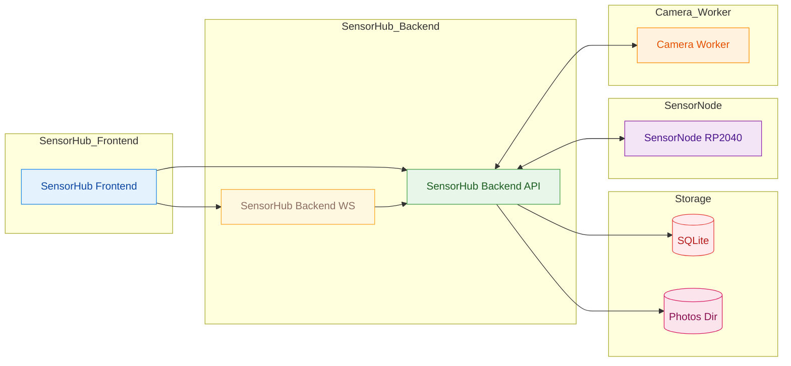
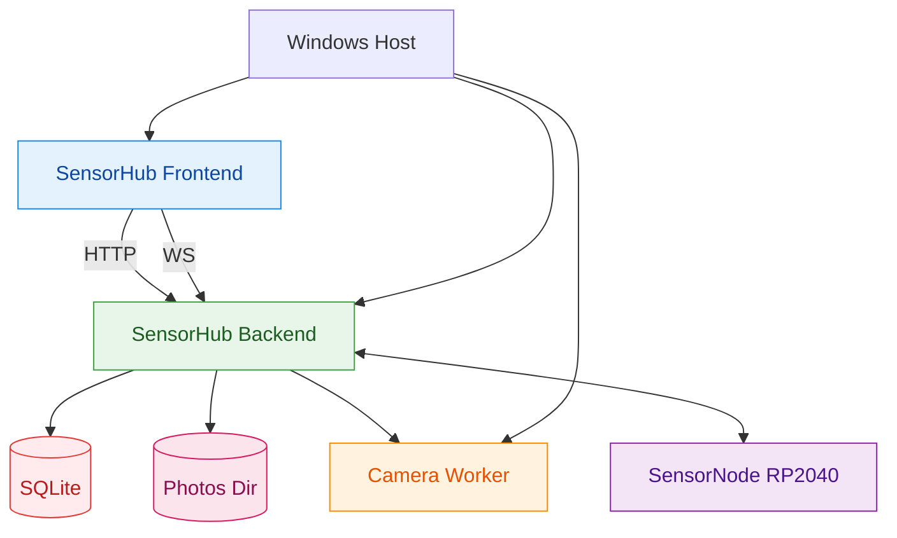

# SensorHub Dokumentation

Diese Dokumentation beschreibt das Zusammenspiel von SensorNode, SensorHub Backend und SensorHub Frontend.
Sie richtet sich an Entwickler:innen und dient als technische Referenz fuer Datenfluss,
Komponenten und Protokolle.

## Inhalt

- `architecture.md` - Systemueberblick, Komponenten und Laufzeitprozesse
- `protocols.md` - Protokolle (Serial, WebSocket, Worker-Frames)
- `api.md` - REST-API und Endpunkte
- `data-model.md` - Datenmodell, Persistenz und Ablage
- `setup.md` - Installation, Voraussetzungen, erste Schritte
- `deployment.md` - Betrieb, Startreihenfolge, Autostart
- `config.md` - Konfiguration, Tokens, Pfade
- `troubleshooting.md` - Fehlerbilder und Loesungen
- `faq.md` - Kurzantworten
- `diagramme/README.md` - Diagramme und Sequenzen

## Schnellzugriff

- Architektur: `architecture.md`
- API: `api.md`
- Protokolle: `protocols.md`
- Datenmodell: `data-model.md`
- Setup: `setup.md`
- Betrieb: `deployment.md`
- Konfiguration: `config.md`
- Troubleshooting: `troubleshooting.md`
- Diagramme (voll): `diagramme/README.md`

## Kurzueberblick

- **SensorNode (RP2040 / Pico)**: Liefert Sensordaten (pH, EC, Temperatur) via Serial-JSON.
- **SensorHub Backend (FastAPI)**: Erkennt Nodes/Camera-Devices, kapselt Serial/Worker,
  speichert Messwerte und stellt HTTP/WS bereit.
- **Camera Worker (C#)**: Listet Kameras und streamt JPEG Frames via Stdout.
- **SensorHub Frontend (Vite + React)**: Bedienoberflaeche, ruft REST und Live-WS ab.

## Hauptdatenpfade

- **Livewerte**: SensorHub Frontend WS -> SensorHub Backend -> Serial JSON -> SensorNode -> Backend -> WS Push
- **History**: SensorHub Backend schreibt Messungen in SQLite -> SensorHub Frontend liest ueber REST
- **Kamera**: SensorHub Frontend REST -> SensorHub Backend startet Worker -> MJPEG Stream

## Verzeichnisuebersicht

- `sensorhub-backend/` - FastAPI Backend, DB und Worker-Ansteuerung
- `sensorhub-frontend/` - Vite + React UI
- `sensornode-firmware/` - Pico Firmware (PlatformIO)
- `data/` - SQLite DB und Fotos
- `docs/` - Dokumentation und Diagramme

## Diagramme (Kurzansicht)

Systemuebersicht:


Deployment (lokal):


Weitere Diagramme und Sequenzen: `diagramme/README.md`.

## Startbefehle (lokal)

### SensorHub Backend

```powershell
cd "sensorhub-backend"
python -m uvicorn app.main:app --host 0.0.0.0 --port 8000 --reload
```

### SensorHub Frontend

```powershell
cd "sensorhub-frontend"
npm install
npm run dev
```

### SensorNode Firmware

```powershell
cd "sensornode-firmware"
pio run
pio run -t upload
```

Optionaler Upload-Port:

```powershell
pio run -t upload --upload-port COM3
```

Hinweis: Das Board ist in `sensornode-firmware/platformio.ini` als `board = pico` konfiguriert.

Weitere Details, Beispiele und Diagramme siehe die Dateien im `docs` Ordner.
