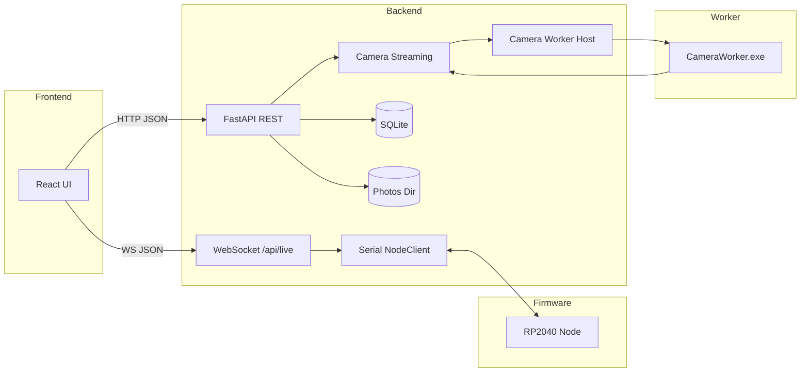

# Architektur und Komponenten

## Systemuebersicht

SensorHub besteht aus drei Hauptschichten:

1. **Firmware** auf dem RP2040 (Pico) sammelt Sensordaten.
2. **Backend** (FastAPI) orchestriert Nodes, speichert Daten und stellt APIs bereit.
3. **Frontend** (Vite + React) zeigt Daten und steuert Setups.

Zusaetzlich existiert ein **Camera Worker** (C#), der das Betriebssystem fuer
Kameralisten und Frame-Streaming nutzt.

## Komponenten

### Firmware (RP2040)

- Datei: `firmware-sensornode-pico/src/main.cpp`
- Sensoren: pH (ADC2), EC (ADC0), Temperatur (OneWire GPIO17)
- Protokoll: JSON Lines ueber Serial (115200 Baud)
- Modi: `real` und `debug` (simulierte Werte)
- Kalibrierung: pH (3 Punkte), EC (2 Punkte), Hash fuer Sync

### Backend (FastAPI)

- Einstieg: `backend/app/main.py`
- Aufgaben:
  - Node-Scan und Handshake
  - Serial Requests fuer Messwerte
  - Speicherung in SQLite
  - REST-API und WebSocket Live-Feed
  - Kamera-Management und Snapshot/Stream
- Persistenz: `data/sensorhub.db` + `data/photos/<setup_id>/`

### Camera Worker (C#)

- Datei: `backend/worker/Program.cs`
- Modus `--list`: Gibt JSON-Liste von Kameras aus
- Modus `--device <id>`: Streamt Frames als Binary-Stream
- Protokoll: Eigener Frame-Header + JPEG Payload

### Frontend (React)

- Einstieg: `frontend/src/main.tsx`
- API-Client: `frontend/src/services/api.ts`
- WebSocket: `frontend/src/services/ws.ts`
- Hauptseiten: `frontend/src/pages/HomePage.tsx`, `SettingsPage.tsx`

## Laufzeitprozesse (Backend)

Beim Start werden mehrere Loops gestartet:

- `node_discovery`: Scannt Serial Ports und erkennt RP2040 Nodes.
- `readings_capture`: Periodisches Speichern von Messwerten (Setup-Intervall).
- `camera_discovery`: Scan per Worker fuer Kamera-Devices.
- `photo_capture`: Periodische Fotoaufnahme pro Setup.

## Komponentendiagramm

## Datenfluss (High Level)

1. Frontend abonniert ein Setup per WebSocket.
2. Backend pollt den Node ueber Serial (`get_all`).
3. Node antwortet mit Messwerten, Backend pusht via WS.
4. In Intervallen werden Messungen in SQLite gespeichert.
5. Kamera-Streams werden on-demand ueber den Worker erzeugt.
