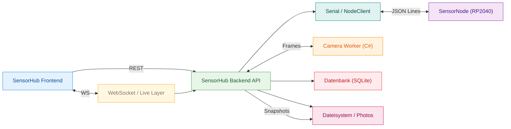
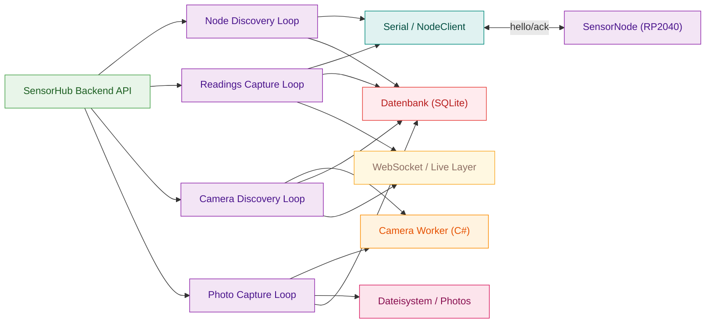
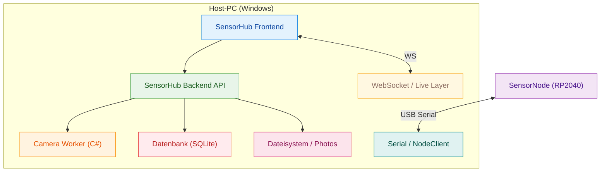

# Architektur

## Systemübersicht
SensorHUB besteht aus einem Web-Frontend, einer FastAPI-Backend-API, einem Live-Layer für WebSockets, einem Serial-NodeClient für RP2040-SensorNodes und einem separaten Camera Worker für Bilddaten. Daten werden in SQLite persistiert, Fotos werden im Dateisystem gespeichert.

Dieses Diagramm zeigt die Hauptkomponenten und ihre Kommunikationswege, um die Systemgrenzen und Datenflüsse auf einen Blick zu verstehen.

- Das Frontend kommuniziert per REST und erhält Live-Daten über WebSockets.
- Der Backend-API-Prozess bündelt alle Zugriffe auf Serial, Kamera-Worker, DB und Dateisystem.
- SensorNodes sprechen ausschließlich das JSON-Line-Protokoll über Serial.
- Bilddaten werden als Frames vom Worker geliefert und als Fotos im Dateisystem abgelegt.

## Komponenten
- **SensorHub Frontend**: Benutzeroberfläche für Setups, Live-Werte, Timeline und Kamera-Preview.
- **SensorHub Backend API**: REST-API für Setups, Nodes, Kameras und Historie, plus WebSocket-Endpunkt `/api/live`.
- **WebSocket / Live Layer**: Verwaltung von Subscriptions und Push von Live-Readings.
- **Serial / NodeClient**: Discovery, Handshake und Abfrage von Sensordaten über JSON Lines.
- **SensorNode (RP2040)**: Sensorabfragen, Glättung, Kalibrierung und Debug-Modus.
- **Camera Worker (C#)**: Zugriff auf Windows MediaCapture und Ausgabe von JPEG-Frames.
- **Datenbank (SQLite)**: Persistenz für Setups, Nodes, Readings, Cameras und Calibration.
- **Dateisystem / Photos**: Ablage von Fotos pro Setup.

## Laufzeitprozesse und Loops
Die Backend-Logik basiert auf mehreren zyklischen Loops, die Discovery, Readings und Fotos unabhängig voneinander ausführen. Das Diagramm zeigt, welche Loop welche Komponente ansteuert.

- Discovery und Capture-Loops laufen getrennt, damit Ausfälle isoliert bleiben.
- Live-Readings werden sowohl gespeichert als auch per WebSocket gepusht.
- Kamera-Discovery aktualisiert die Geräteliste und versorgt das Frontend mit Status.
- Fotos werden getrennt von Live-Frames im Dateisystem persistiert.

## Lokales Deployment
SensorHUB läuft lokal auf einem Host-PC. Backend und Frontend sind getrennte Prozesse, der Camera Worker wird bei Bedarf gestartet. Die SensorNodes hängen per USB am Host.

- Frontend und Backend teilen sich denselben Host, sind aber logisch getrennt.
- Der Camera Worker ist ein eigener Prozess, der bei Bedarf gestartet wird.
- SensorNodes kommunizieren nur über die Serial-Verbindung zum Host-PC.
