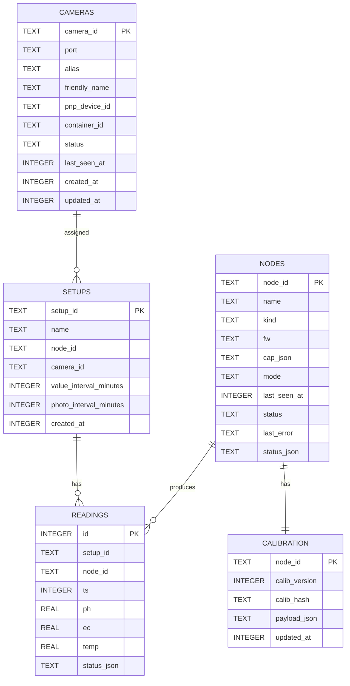

# Datenmodell

Das Datenmodell basiert auf SQLite und wird beim Backend-Start initialisiert. Das ER-Diagramm gibt einen Überblick über die Entitäten und ihre konzeptionellen Beziehungen.

## Tabellenbeschreibung

### `setups`
- Repräsentiert ein logisches Setup (ein Node + optional eine Kamera).
- `value_interval_minutes` und `photo_interval_minutes` steuern die Capture-Intervalle.
- `camera_id` referenziert eine Kamera aus der Liste der erkannten Geräte.

### `nodes`
- Eintrag pro erkannter SensorNode (UID-basiert).
- `cap_json` enthält die Capabilities als JSON-String.
- `last_seen_at`, `status` und `status_json` bilden die Online/Offline-Sicht ab.

### `readings`
- Zeitstempel-basierte Messwerte pro Setup und Node.
- `status_json` enthält den Status des Readings (z. B. `["ok"]`).

### `cameras`
- Abbildung der per Worker gefundenen Kamerageräte.
- `port`, `pnp_device_id`, `container_id` dienen der Zuordnung und Stabilität.

### `calibration`
- Versionierte Kalibrierung pro Node.
- `payload_json` enthält die Kalibrierpunkte (pH/EC).

## Mapping Backend ↔ Frontend Felder
Die API liefert Felder in camelCase, während die DB snake_case verwendet.

### Setup
- `setup_id` ↔ `setupId`
- `node_id` ↔ `nodeId`
- `camera_id` ↔ `cameraPort` (Frontend-Sicht auf die Kamera-Referenz)
- `value_interval_minutes` ↔ `valueIntervalMinutes`
- `photo_interval_minutes` ↔ `photoIntervalMinutes`
- `created_at` ↔ `createdAt`

### Node
- `node_id` ↔ `nodeId`
- `name` ↔ `alias` (Frontend nutzt `alias`, Backend speichert `name`)
- `cap_json` ↔ keine direkte Frontend-Entsprechung (primär Backend-intern)
- `last_seen_at` ↔ `lastSeenAt`
- `last_error` ↔ `lastError`

### Reading
- `setup_id` ↔ `setupId`
- `node_id` ↔ `nodeId`
- `status_json` ↔ `status` (Frontend als Array, Backend intern als JSON)

### Camera
- `camera_id` ↔ `cameraId`
- `port` ↔ `deviceId`
- `friendly_name` ↔ `friendlyName`
- `pnp_device_id` ↔ `pnpDeviceId`
- `container_id` ↔ `containerId`
