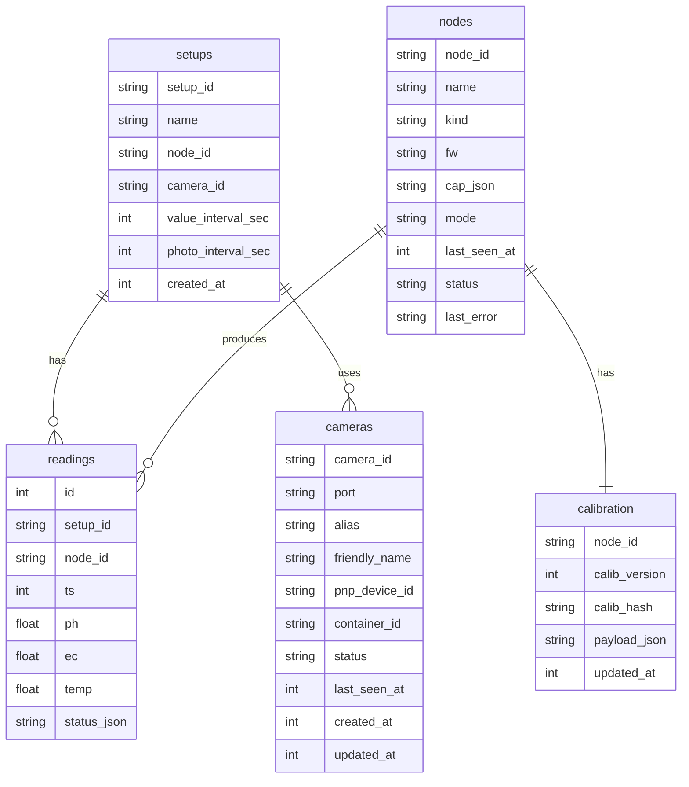

# Datenmodell und Persistenz

Persistenz liegt in `data/sensorhub.db` (SQLite) und Fotos in `data/photos/`.

## ER Diagramm

## Tabellen

### setups

- `setup_id` (PK)
- `name`
- `node_id` (nullable)
- `camera_id` (nullable)
- `value_interval_sec` (Legacy-Name, gespeichert in Minuten)
- `photo_interval_sec` (Legacy-Name, gespeichert in Minuten)
- `created_at`

### nodes

- `node_id` (PK, z.B. COM Port)
- `name` (Alias)
- `kind` (real)
- `fw` (SensorNode Firmware Version)
- `cap_json` (Capabilities JSON)
- `mode` (real/debug)
- `last_seen_at`
- `status` (online/offline)
- `last_error`

### calibration

- `node_id` (PK)
- `calib_version`
- `calib_hash`
- `payload_json`
- `updated_at`

### readings

- `id` (PK)
- `setup_id`
- `node_id`
- `ts` (Epoch ms)
- `ph`, `ec`, `temp` (nullable)
- `status_json` (JSON-String eines Array)

### cameras

- `camera_id` (PK, z.B. usb#### oder internal:hash)
- `port` (USB Port oder leerer String)
- `alias`
- `friendly_name`
- `pnp_device_id`
- `container_id`
- `status` (online/offline)
- `last_seen_at`
- `created_at`
- `updated_at`

## Dateien

- `data/photos/<setup_id>/<setup_id>_<yyyy-mm-dd_HH-MM-SS>.jpg`
- SensorHub Backend mountet `data/` unter `/data`, z.B. `/data/photos/...`

## Mapping zu SensorHub Frontend Types

### Setup (SensorHub Frontend)

- `setupId` -> `setups.setup_id`
- `port` -> `setups.node_id`
- `cameraPort` -> `setups.camera_id`
- `valueIntervalMinutes` -> `setups.value_interval_sec` (Minutenwert)
- `photoIntervalMinutes` -> `setups.photo_interval_sec` (Minutenwert)
- `createdAt` -> `setups.created_at` (API-Feld, Frontend-Typ aktuell ohne Feld)

### NodeInfo (SensorHub Frontend)

- `port` -> `nodes.node_id`
- `alias` -> `nodes.name`
- `kind` -> `nodes.kind`
- `fw` -> `nodes.fw`
- `mode` -> `nodes.mode`
- `status` -> `nodes.status`
- `capJson` -> `nodes.cap_json`
- `lastSeenAt` -> `nodes.last_seen_at`
- `lastError` -> `nodes.last_error`

### CameraDevice (SensorHub Frontend)

- `cameraId` -> `cameras.camera_id`
- `deviceId` -> `cameras.camera_id`
- `alias` -> `cameras.alias`
- `pnpDeviceId` -> `cameras.pnp_device_id`
- `friendlyName` -> `cameras.friendly_name`
- `containerId` -> `cameras.container_id`
- `status` -> `cameras.status`
