# Diagramme

Alle Diagramme sind hier eingebettet. Quellen: `system-overview.md`, `nodes.md`,
`camera-history-admin.md`, `frontend-and-setups.md`.

## System Overview

### Komponentenbeziehungen

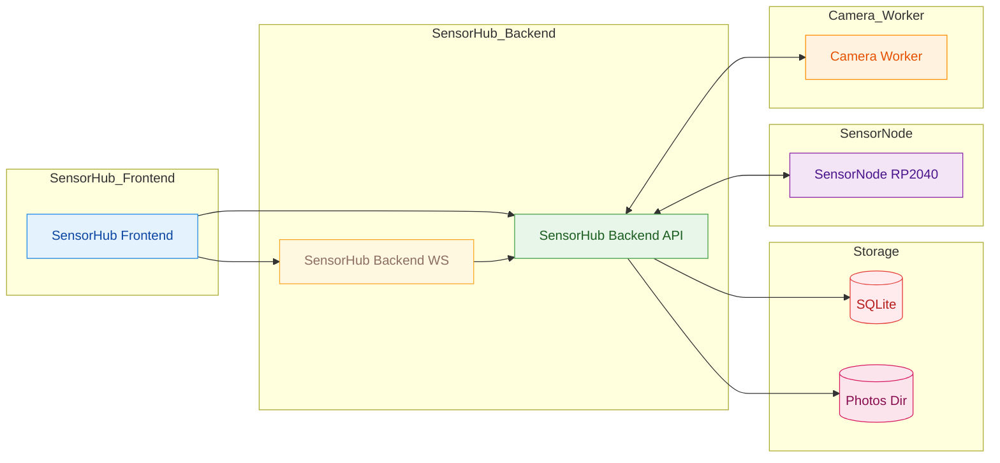
```mermaid
flowchart LR
  subgraph SensorHub_Frontend
    UI[SensorHub Frontend]
  end

  subgraph SensorHub_Backend
    API[SensorHub Backend API]
    WS[SensorHub Backend WS]
  end

  subgraph Storage
    DB[(SQLite)]
    Photos[(Photos Dir)]
  end

  subgraph SensorNode
    Node[SensorNode RP2040]
  end

  subgraph Camera_Worker
    Worker[Camera Worker]
  end

  UI --> API
  UI --> WS
  WS --> API
  API --> DB
  API --> Photos
  API <--> Node
  API <--> Worker

  style UI fill:#E3F2FD,stroke:#1E88E5,color:#0D47A1
  style API fill:#E8F5E9,stroke:#43A047,color:#1B5E20
  style WS fill:#FFF8E1,stroke:#F9A825,color:#8D6E63
  style DB fill:#FFEBEE,stroke:#E53935,color:#B71C1C
  style Photos fill:#FCE4EC,stroke:#D81B60,color:#880E4F
  style Node fill:#F3E5F5,stroke:#8E24AA,color:#4A148C
  style Worker fill:#FFF3E0,stroke:#FB8C00,color:#E65100
```

### Deployment

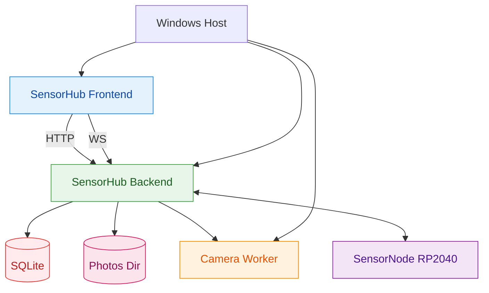
```mermaid
flowchart TB
  Host[Windows Host]
  Backend[SensorHub Backend]
  Frontend[SensorHub Frontend]
  Worker[Camera Worker]
  DB[(SQLite)]
  Photos[(Photos Dir)]
  Node[SensorNode RP2040]

  Frontend -->|HTTP| Backend
  Frontend -->|WS| Backend
  Backend --> DB
  Backend --> Photos
  Backend --> Worker
  Backend <--> Node
  Host --> Backend
  Host --> Frontend
  Host --> Worker

  style Frontend fill:#E3F2FD,stroke:#1E88E5,color:#0D47A1
  style Backend fill:#E8F5E9,stroke:#43A047,color:#1B5E20
  style Worker fill:#FFF3E0,stroke:#FB8C00,color:#E65100
  style DB fill:#FFEBEE,stroke:#E53935,color:#B71C1C
  style Photos fill:#FCE4EC,stroke:#D81B60,color:#880E4F
  style Node fill:#F3E5F5,stroke:#8E24AA,color:#4A148C
```

## Data Model ER

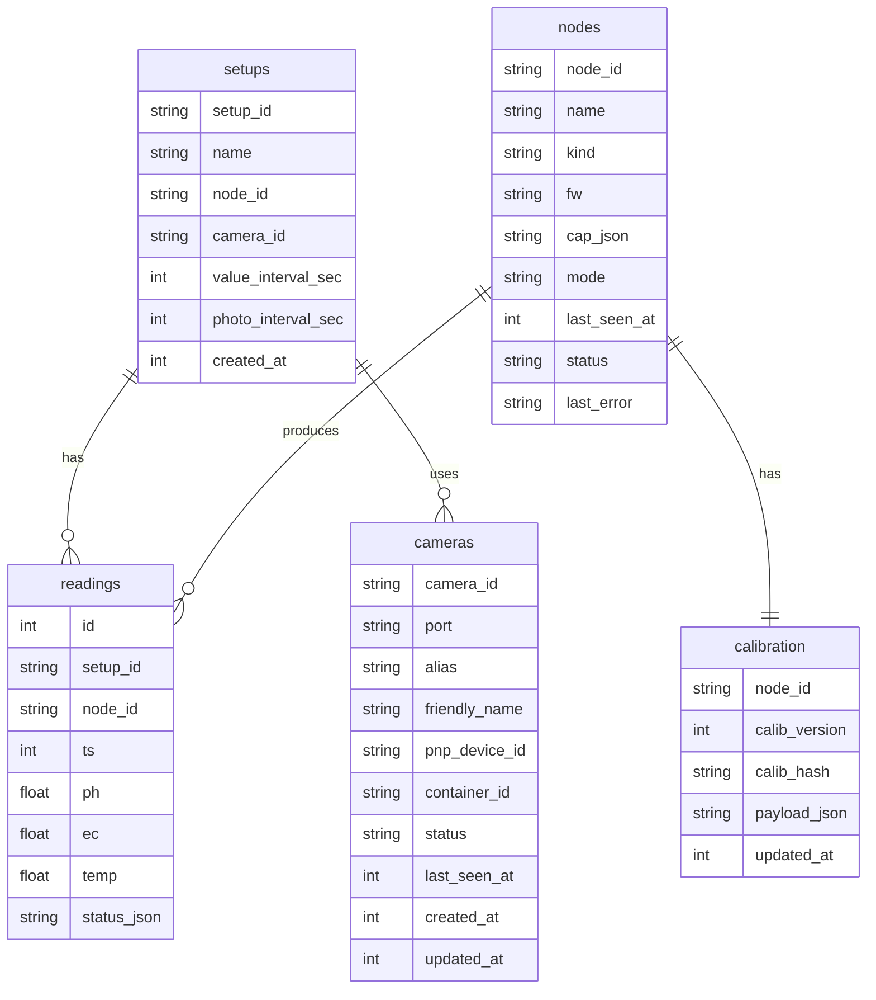
```mermaid
erDiagram
  setups ||--o{ readings : has
  nodes ||--o{ readings : produces
  setups ||--o{ cameras : uses
  nodes ||--|| calibration : has

  setups {
    string setup_id
    string name
    string node_id
    string camera_id
    int value_interval_sec
    int photo_interval_sec
    int created_at
  }

  nodes {
    string node_id
    string name
    string kind
    string fw
    string cap_json
    string mode
    int last_seen_at
    string status
    string last_error
  }

  readings {
    int id
    string setup_id
    string node_id
    int ts
    float ph
    float ec
    float temp
    string status_json
  }

  cameras {
    string camera_id
    string port
    string alias
    string friendly_name
    string pnp_device_id
    string container_id
    string status
    int last_seen_at
    int created_at
    int updated_at
  }

  calibration {
    string node_id
    int calib_version
    string calib_hash
    string payload_json
    int updated_at
  }
```

## Error Flows

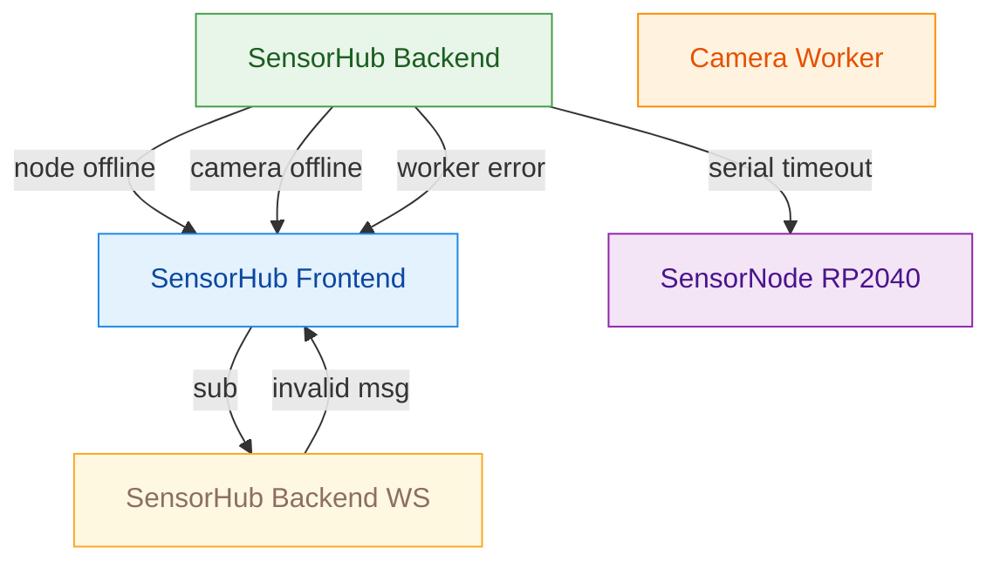
```mermaid
flowchart TB
  UI[SensorHub Frontend]
  Backend[SensorHub Backend]
  WS[SensorHub Backend WS]
  Node[SensorNode RP2040]
  Worker[Camera Worker]

  UI -->|sub| WS
  WS -->|invalid msg| UI
  Backend -->|node offline| UI
  Backend -->|camera offline| UI
  Backend -->|worker error| UI
  Backend -->|serial timeout| Node

  style UI fill:#E3F2FD,stroke:#1E88E5,color:#0D47A1
  style Backend fill:#E8F5E9,stroke:#43A047,color:#1B5E20
  style WS fill:#FFF8E1,stroke:#F9A825,color:#8D6E63
  style Node fill:#F3E5F5,stroke:#8E24AA,color:#4A148C
  style Worker fill:#FFF3E0,stroke:#FB8C00,color:#E65100
```

## Nodes

### Node Discovery und Handshake

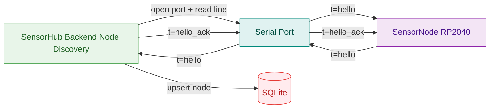
```mermaid
flowchart LR
  API[SensorHub Backend Node Discovery]
  Serial[Serial Port]
  Node[SensorNode RP2040]
  DB[(SQLite)]

  API -->|open port + read line| Serial
  Serial -->|t=hello| API
  Serial -->|t=hello| Node
  Node -->|t=hello| Serial
  API -->|t=hello_ack| Serial
  Serial -->|t=hello_ack| Node
  API -->|upsert node| DB

  style API fill:#E8F5E9,stroke:#43A047,color:#1B5E20
  style Serial fill:#E0F2F1,stroke:#00897B,color:#004D40
  style Node fill:#F3E5F5,stroke:#8E24AA,color:#4A148C
  style DB fill:#FFEBEE,stroke:#E53935,color:#B71C1C
```

### Kalibrierung Sync

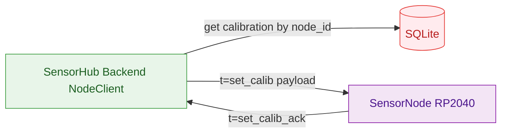
```mermaid
flowchart LR
  API[SensorHub Backend NodeClient]
  DB[(SQLite)]
  Node[SensorNode RP2040]

  API -->|get calibration by node_id| DB
  API -->|t=set_calib payload| Node
  Node -->|t=set_calib_ack| API

  style API fill:#E8F5E9,stroke:#43A047,color:#1B5E20
  style DB fill:#FFEBEE,stroke:#E53935,color:#B71C1C
  style Node fill:#F3E5F5,stroke:#8E24AA,color:#4A148C
```

### Readings Capture Loop (Persistenz)

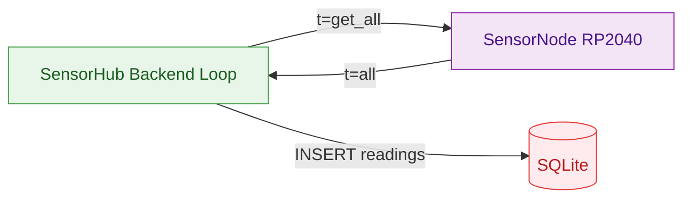
```mermaid
flowchart LR
  API[SensorHub Backend Loop]
  Node[SensorNode RP2040]
  DB[(SQLite)]

  API -->|t=get_all| Node
  Node -->|t=all| API
  API -->|INSERT readings| DB

  style API fill:#E8F5E9,stroke:#43A047,color:#1B5E20
  style Node fill:#F3E5F5,stroke:#8E24AA,color:#4A148C
  style DB fill:#FFEBEE,stroke:#E53935,color:#B71C1C
```

### Live Reading (Nodes)

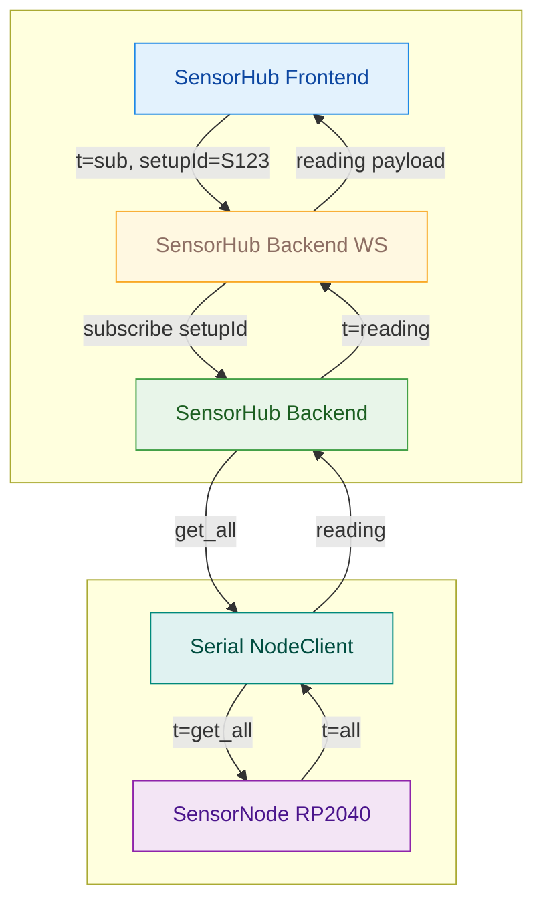
```mermaid
flowchart TB
  subgraph Top[" "]
    direction LR
    UI[SensorHub Frontend]
    WS[SensorHub Backend WS]
    Backend[SensorHub Backend]
  end

  subgraph Bottom[" "]
    direction LR
    Serial[Serial NodeClient]
    Node[SensorNode RP2040]
  end

  UI -->|t=sub, setupId=S123| WS
  WS -->|subscribe setupId| Backend
  Backend -->|get_all| Serial
  Serial -->|t=get_all| Node
  Node -->|t=all| Serial
  Serial -->|reading| Backend
  Backend -->|t=reading| WS
  WS -->|reading payload| UI

  style UI fill:#E3F2FD,stroke:#1E88E5,color:#0D47A1
  style WS fill:#FFF8E1,stroke:#F9A825,color:#8D6E63
  style Backend fill:#E8F5E9,stroke:#43A047,color:#1B5E20
  style Serial fill:#E0F2F1,stroke:#00897B,color:#004D40
  style Node fill:#F3E5F5,stroke:#8E24AA,color:#4A148C
```

### Node States

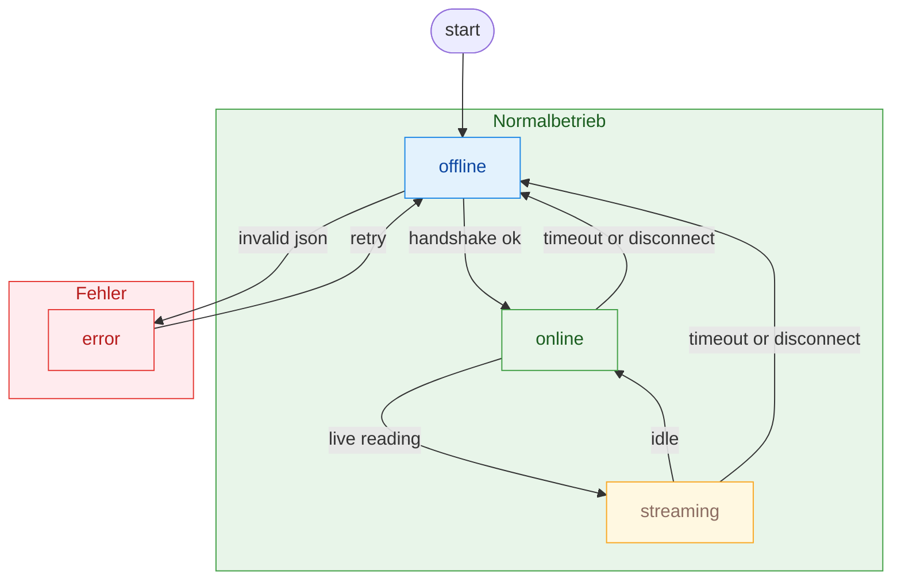
```mermaid
flowchart TB
  Start([start])

  subgraph Normalbetrieb
    direction TB
    Offline[offline]
    Online[online]
    Streaming[streaming]
  end

  subgraph Fehler
    direction TB
    Error[error]
  end

  Start --> Offline
  Offline -->|handshake ok| Online
  Online -->|live reading| Streaming
  Streaming -->|idle| Online

  Online -->|timeout or disconnect| Offline
  Streaming -->|timeout or disconnect| Offline
  Offline -->|invalid json| Error
  Error -->|retry| Offline

  style Normalbetrieb fill:#E8F5E9,stroke:#43A047,color:#1B5E20
  style Fehler fill:#FFEBEE,stroke:#E53935,color:#B71C1C
  style Offline fill:#E3F2FD,stroke:#1E88E5,color:#0D47A1
  style Online fill:#E8F5E9,stroke:#43A047,color:#1B5E20
  style Streaming fill:#FFF8E1,stroke:#F9A825,color:#8D6E63
  style Error fill:#FFEBEE,stroke:#E53935,color:#B71C1C
```

## Kamera, History, Export, Admin

### Snapshot / Stream

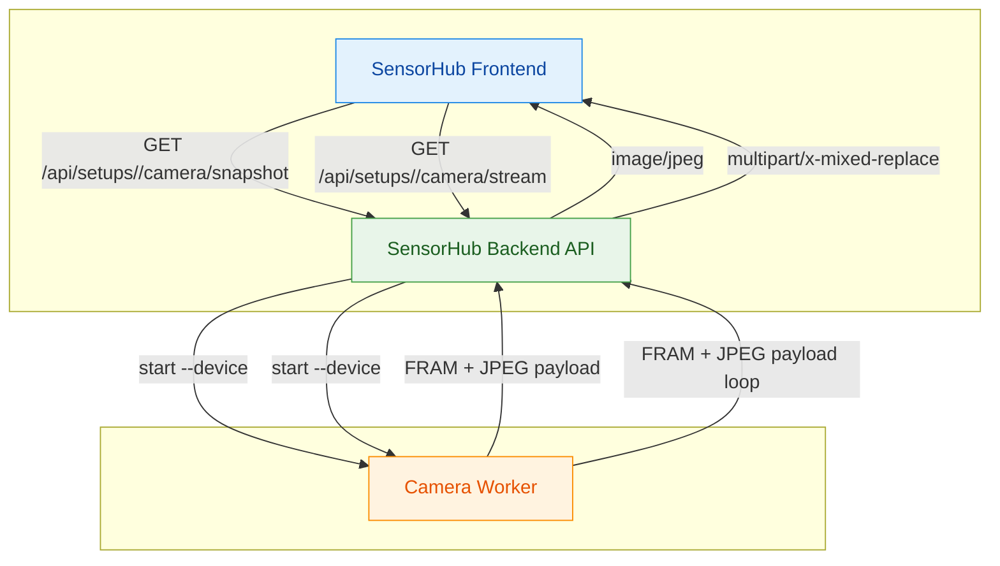
```mermaid
flowchart TB
  subgraph Top[" "]
    direction LR
    UI[SensorHub Frontend]
    API[SensorHub Backend API]
  end

  subgraph Bottom[" "]
    direction LR
    Worker[Camera Worker]
  end

  UI -->|GET /api/setups/<setupId>/camera/snapshot| API
  API -->|start --device <id>| Worker
  Worker -->|FRAM + JPEG payload| API
  API -->|image/jpeg| UI

  UI -->|GET /api/setups/<setupId>/camera/stream| API
  API -->|start --device <id>| Worker
  Worker -->|FRAM + JPEG payload loop| API
  API -->|multipart/x-mixed-replace| UI

  style UI fill:#E3F2FD,stroke:#1E88E5,color:#0D47A1
  style API fill:#E8F5E9,stroke:#43A047,color:#1B5E20
  style Worker fill:#FFF3E0,stroke:#FB8C00,color:#E65100
```

### Photo Capture Loop (Persistenz)

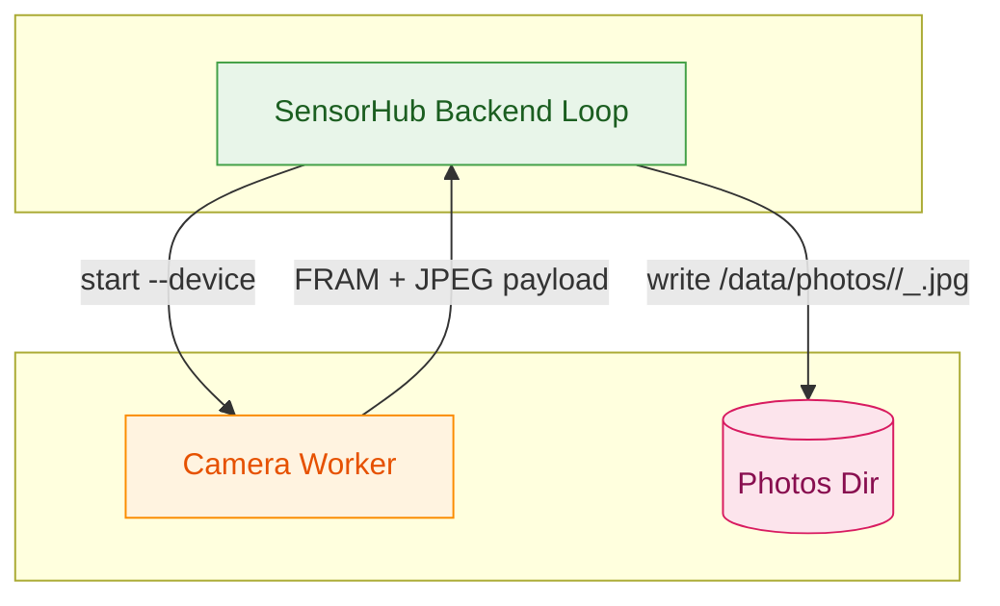
```mermaid
flowchart TB
  subgraph Top[" "]
    direction LR
    API[SensorHub Backend Loop]
  end

  subgraph Bottom[" "]
    direction LR
    Worker[Camera Worker]
    FS[(Photos Dir)]
  end

  API -->|start --device <id>| Worker
  Worker -->|FRAM + JPEG payload| API
  API -->|write /data/photos/<setup_id>/<setup_id>_<yyyy-mm-dd_HH-MM-SS>.jpg| FS

  style API fill:#E8F5E9,stroke:#43A047,color:#1B5E20
  style Worker fill:#FFF3E0,stroke:#FB8C00,color:#E65100
  style FS fill:#FCE4EC,stroke:#D81B60,color:#880E4F
```

### Kamera Discovery

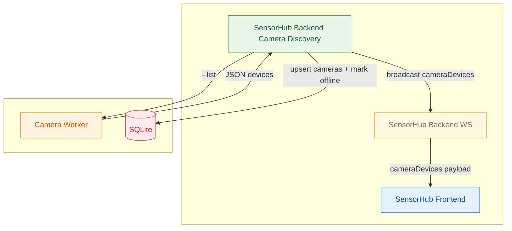
```mermaid
flowchart TB
  subgraph Top[" "]
    direction LR
    UI[SensorHub Frontend]
    WS[SensorHub Backend WS]
    API[SensorHub Backend Camera Discovery]
  end

  subgraph Bottom[" "]
    direction LR
    Worker[Camera Worker]
    DB[(SQLite)]
  end

  API -->|--list| Worker
  Worker -->|JSON devices| API
  API -->|upsert cameras + mark offline| DB
  API -->|broadcast cameraDevices| WS
  WS -->|cameraDevices payload| UI

  style API fill:#E8F5E9,stroke:#43A047,color:#1B5E20
  style Worker fill:#FFF3E0,stroke:#FB8C00,color:#E65100
  style DB fill:#FFEBEE,stroke:#E53935,color:#B71C1C
  style WS fill:#FFF8E1,stroke:#F9A825,color:#8D6E63
  style UI fill:#E3F2FD,stroke:#1E88E5,color:#0D47A1
```

### Kamera Entfernen

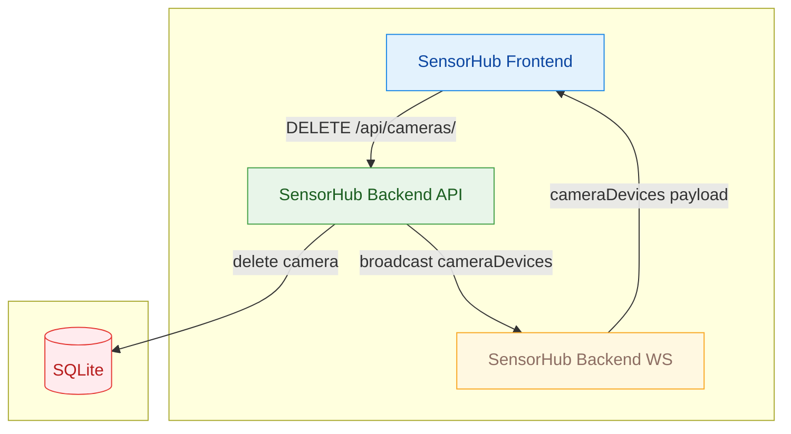
```mermaid
flowchart TB
  subgraph Top[" "]
    direction LR
    UI[SensorHub Frontend]
    API[SensorHub Backend API]
    WS[SensorHub Backend WS]
  end

  subgraph Bottom[" "]
    direction LR
    DB[(SQLite)]
  end

  UI -->|DELETE /api/cameras/<cameraId>| API
  API -->|delete camera| DB
  API -->|broadcast cameraDevices| WS
  WS -->|cameraDevices payload| UI

  style UI fill:#E3F2FD,stroke:#1E88E5,color:#0D47A1
  style API fill:#E8F5E9,stroke:#43A047,color:#1B5E20
  style DB fill:#FFEBEE,stroke:#E53935,color:#B71C1C
  style WS fill:#FFF8E1,stroke:#F9A825,color:#8D6E63
```

### Manuelles Foto speichern

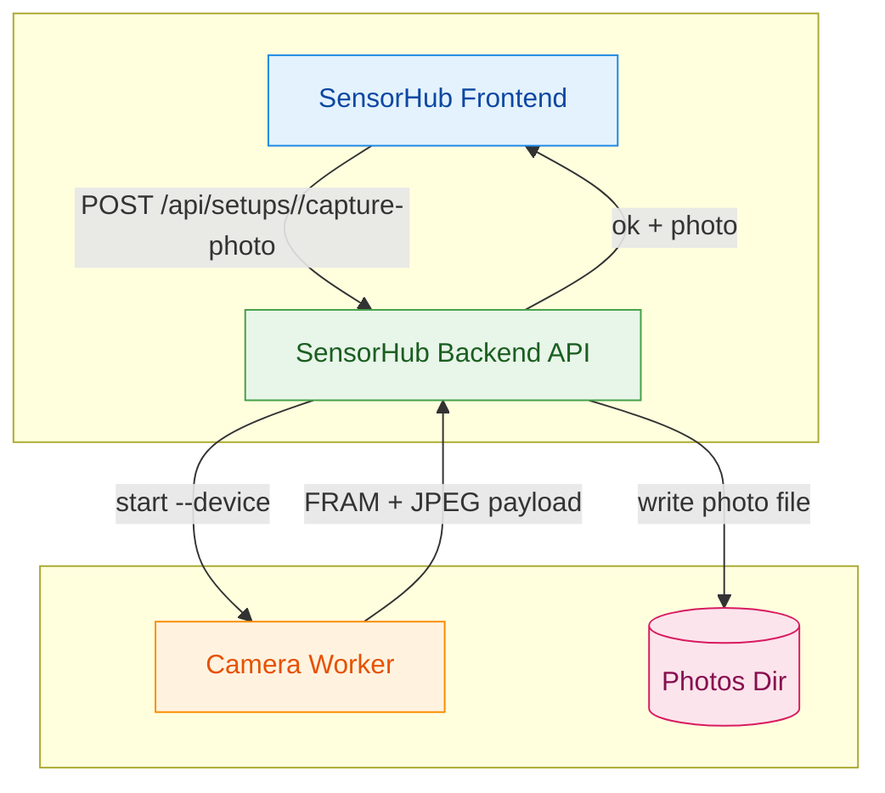
```mermaid
flowchart TB
  subgraph Top[" "]
    direction LR
    UI[SensorHub Frontend]
    API[SensorHub Backend API]
  end

  subgraph Bottom[" "]
    direction LR
    Worker[Camera Worker]
    FS[(Photos Dir)]
  end

  UI -->|POST /api/setups/<setupId>/capture-photo| API
  API -->|start --device <id>| Worker
  Worker -->|FRAM + JPEG payload| API
  API -->|write photo file| FS
  API -->|ok + photo| UI

  style UI fill:#E3F2FD,stroke:#1E88E5,color:#0D47A1
  style API fill:#E8F5E9,stroke:#43A047,color:#1B5E20
  style Worker fill:#FFF3E0,stroke:#FB8C00,color:#E65100
  style FS fill:#FCE4EC,stroke:#D81B60,color:#880E4F
```

### Setup History (Readings + Photos)

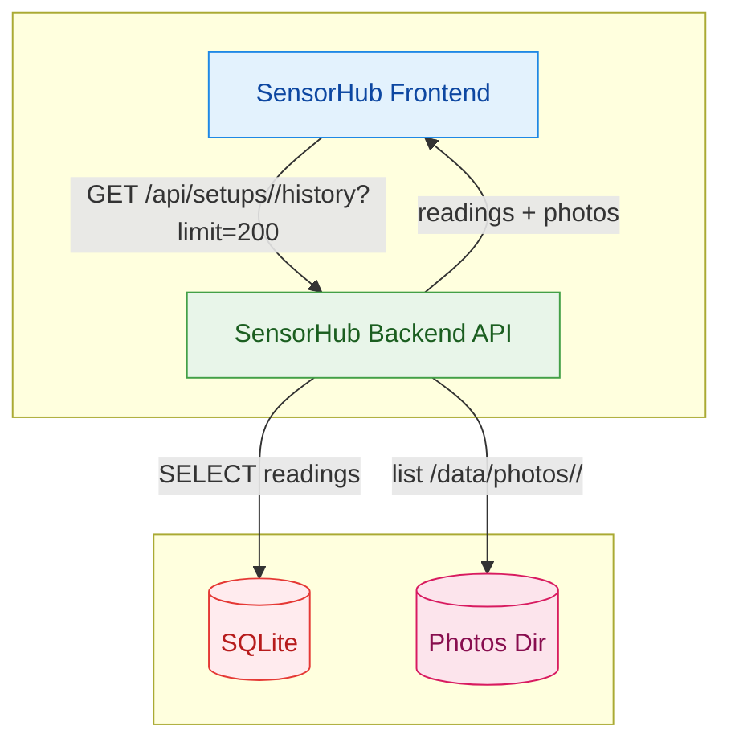
```mermaid
flowchart TB
  subgraph Top[" "]
    direction LR
    UI[SensorHub Frontend]
    API[SensorHub Backend API]
  end

  subgraph Bottom[" "]
    direction LR
    DB[(SQLite)]
    FS[(Photos Dir)]
  end

  UI -->|GET /api/setups/<setupId>/history?limit=200| API
  API -->|SELECT readings| DB
  API -->|list /data/photos/<setup_id>/| FS
  API -->|readings + photos| UI

  style UI fill:#E3F2FD,stroke:#1E88E5,color:#0D47A1
  style API fill:#E8F5E9,stroke:#43A047,color:#1B5E20
  style DB fill:#FFEBEE,stroke:#E53935,color:#B71C1C
  style FS fill:#FCE4EC,stroke:#D81B60,color:#880E4F
```

### Export (ZIP mit CSV)

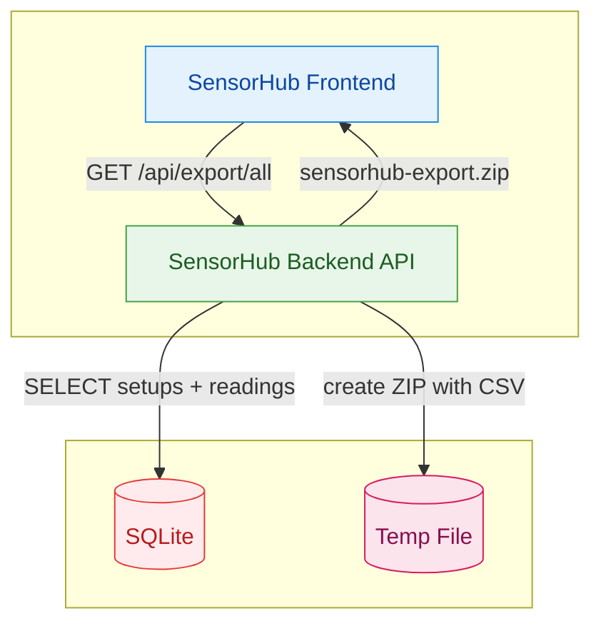
```mermaid
flowchart TB
  subgraph Top[" "]
    direction LR
    UI[SensorHub Frontend]
    API[SensorHub Backend API]
  end

  subgraph Bottom[" "]
    direction LR
    DB[(SQLite)]
    FS[(Temp File)]
  end

  UI -->|GET /api/export/all| API
  API -->|SELECT setups + readings| DB
  API -->|create ZIP with CSV| FS
  API -->|sensorhub-export.zip| UI

  style UI fill:#E3F2FD,stroke:#1E88E5,color:#0D47A1
  style API fill:#E8F5E9,stroke:#43A047,color:#1B5E20
  style DB fill:#FFEBEE,stroke:#E53935,color:#B71C1C
  style FS fill:#FCE4EC,stroke:#D81B60,color:#880E4F
```

### Admin Reset

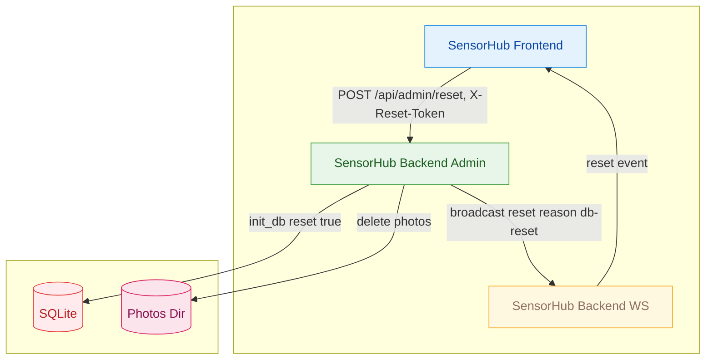
```mermaid
flowchart TB
  subgraph Top[" "]
    direction LR
    UI[SensorHub Frontend]
    API[SensorHub Backend Admin]
    WS[SensorHub Backend WS]
  end

  subgraph Bottom[" "]
    direction LR
    DB[(SQLite)]
    FS[(Photos Dir)]
  end

  UI -->|POST /api/admin/reset, X-Reset-Token| API
  API -->|init_db reset true| DB
  API -->|delete photos| FS
  API -->|broadcast reset reason db-reset| WS
  WS -->|reset event| UI

  style UI fill:#E3F2FD,stroke:#1E88E5,color:#0D47A1
  style API fill:#E8F5E9,stroke:#43A047,color:#1B5E20
  style DB fill:#FFEBEE,stroke:#E53935,color:#B71C1C
  style FS fill:#FCE4EC,stroke:#D81B60,color:#880E4F
  style WS fill:#FFF8E1,stroke:#F9A825,color:#8D6E63
```

## Frontend and Setups

### Frontend Flow

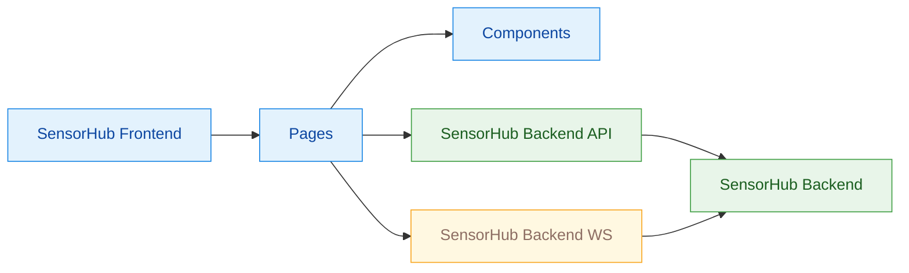
```mermaid
flowchart LR
  UI[SensorHub Frontend]
  Pages[Pages]
  Components[Components]
  API[SensorHub Backend API]
  WS[SensorHub Backend WS]
  Backend[SensorHub Backend]

  UI --> Pages
  Pages --> Components
  Pages --> API
  Pages --> WS
  API --> Backend
  WS --> Backend

  style UI fill:#E3F2FD,stroke:#1E88E5,color:#0D47A1
  style Pages fill:#E3F2FD,stroke:#1E88E5,color:#0D47A1
  style Components fill:#E3F2FD,stroke:#1E88E5,color:#0D47A1
  style API fill:#E8F5E9,stroke:#43A047,color:#1B5E20
  style WS fill:#FFF8E1,stroke:#F9A825,color:#8D6E63
  style Backend fill:#E8F5E9,stroke:#43A047,color:#1B5E20
```

### Setup Verwaltung

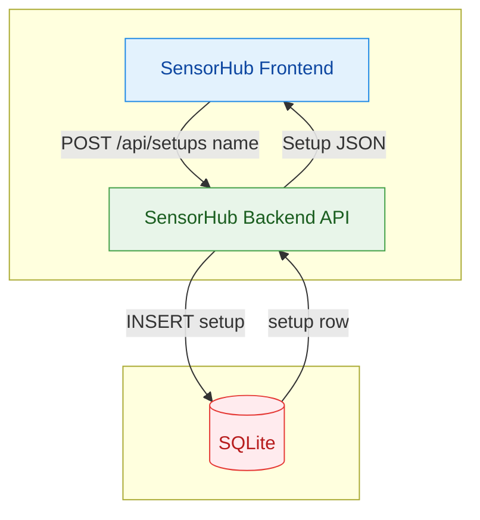
```mermaid
flowchart TB
  subgraph Top[" "]
    direction LR
    UI[SensorHub Frontend]
    API[SensorHub Backend API]
  end

  subgraph Bottom[" "]
    direction LR
    DB[(SQLite)]
  end

  UI -->|POST /api/setups name| API
  API -->|INSERT setup| DB
  DB -->|setup row| API
  API -->|Setup JSON| UI

  style UI fill:#E3F2FD,stroke:#1E88E5,color:#0D47A1
  style API fill:#E8F5E9,stroke:#43A047,color:#1B5E20
  style DB fill:#FFEBEE,stroke:#E53935,color:#B71C1C
```

### Manuelle Messung speichern

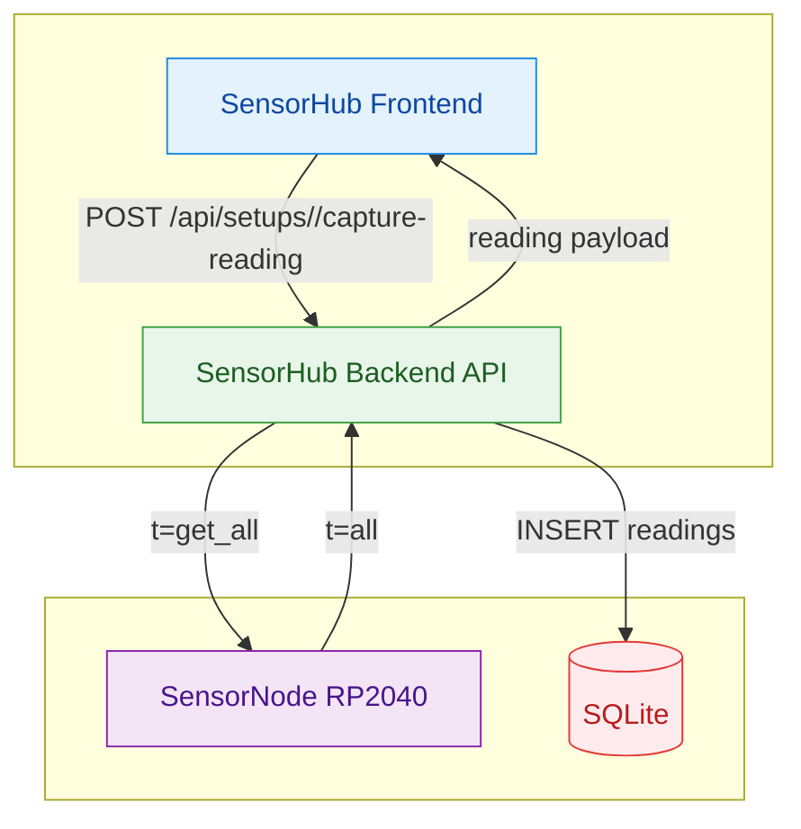
```mermaid
flowchart TB
  subgraph Top[" "]
    direction LR
    UI[SensorHub Frontend]
    API[SensorHub Backend API]
  end

  subgraph Bottom[" "]
    direction LR
    Node[SensorNode RP2040]
    DB[(SQLite)]
  end

  UI -->|POST /api/setups/<setupId>/capture-reading| API
  API -->|t=get_all| Node
  Node -->|t=all| API
  API -->|INSERT readings| DB
  API -->|reading payload| UI

  style UI fill:#E3F2FD,stroke:#1E88E5,color:#0D47A1
  style API fill:#E8F5E9,stroke:#43A047,color:#1B5E20
  style Node fill:#F3E5F5,stroke:#8E24AA,color:#4A148C
  style DB fill:#FFEBEE,stroke:#E53935,color:#B71C1C
```
