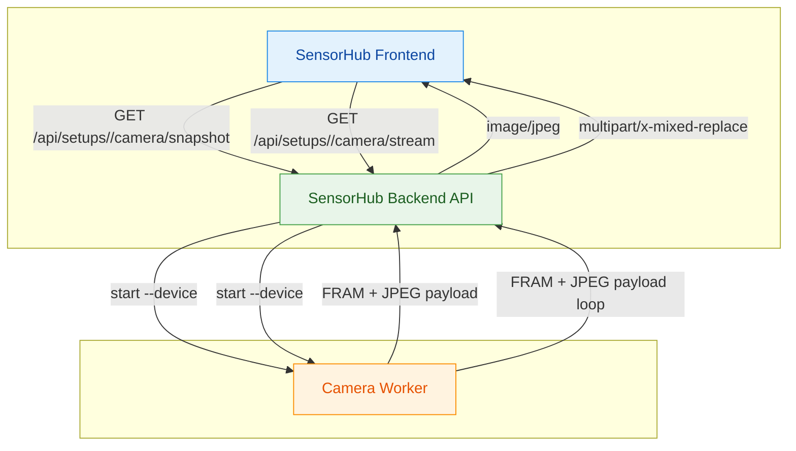
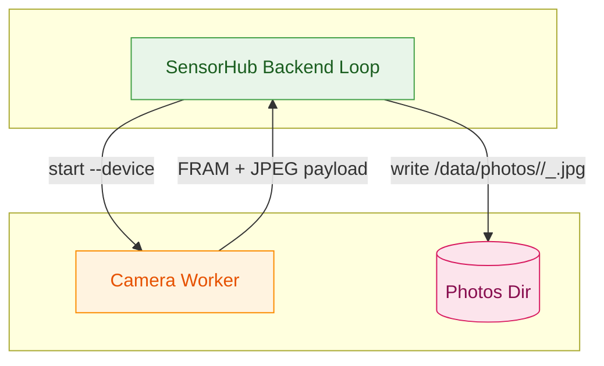
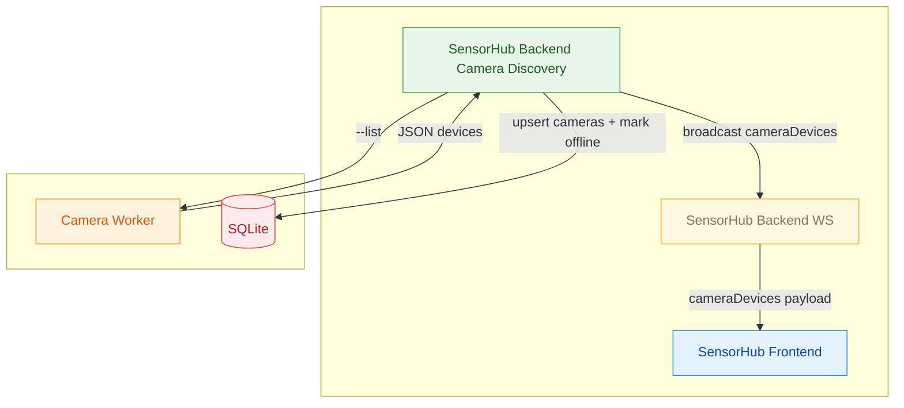
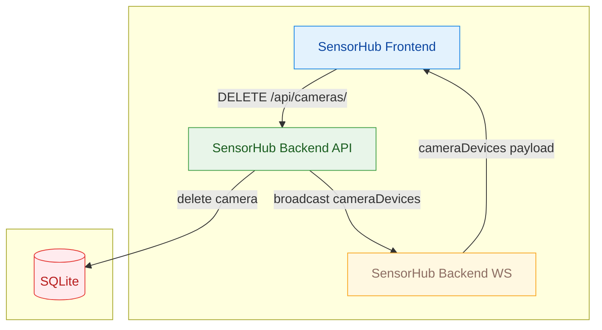
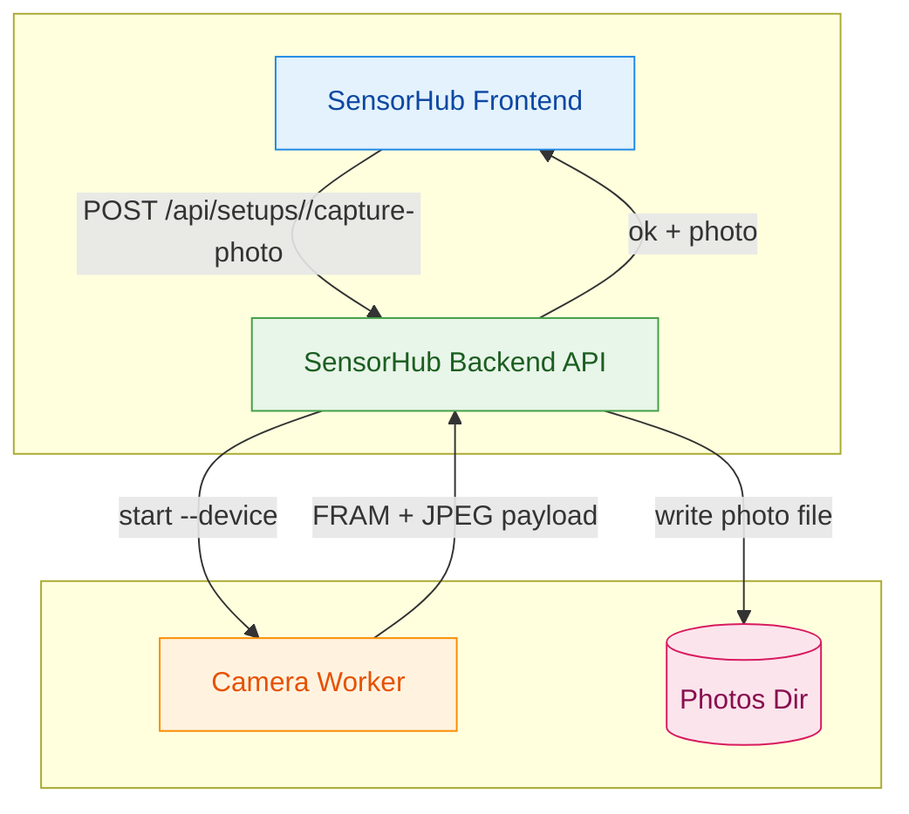
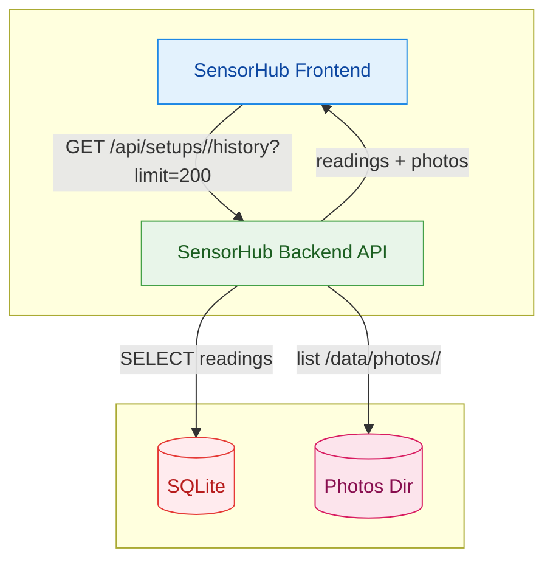
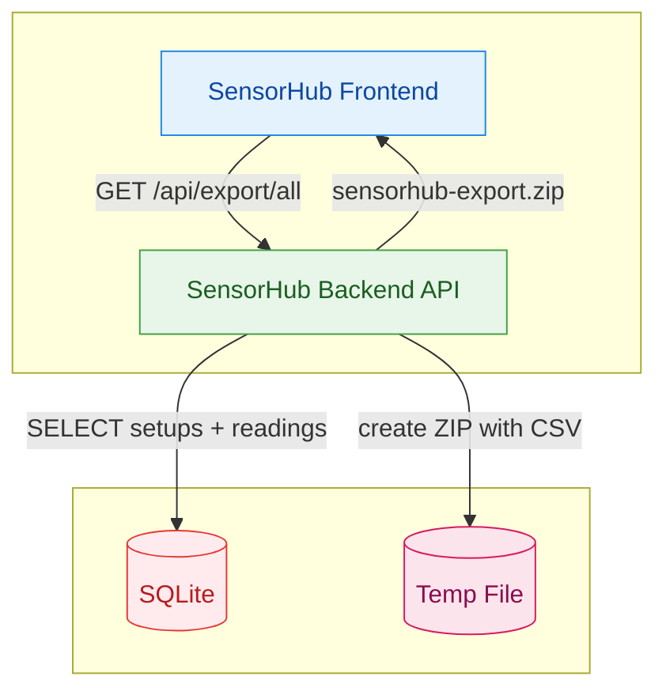
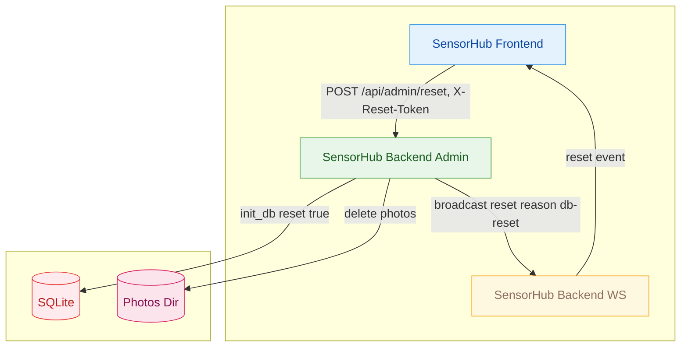

# Kamera, History, Export, Admin

## Kamera

### Snapshot / Stream

### Photo Capture Loop (Persistenz)

### Kamera Discovery

### Kamera Entfernen

### Manuelles Foto speichern

## History, Export, Admin

### Setup History (Readings + Photos)

### Export (ZIP mit CSV)

### Admin Reset

