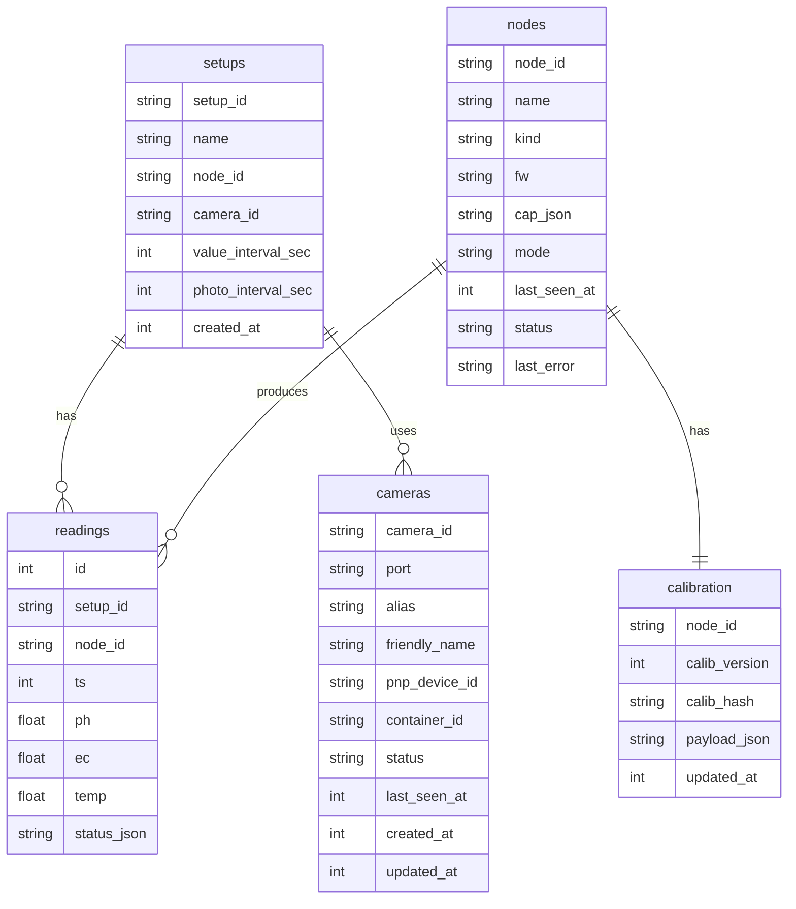

# Data Model ER

```mermaid
erDiagram
  setups ||--o{ readings : has
  nodes ||--o{ readings : produces
  setups ||--o{ cameras : uses
  nodes ||--|| calibration : has

  setups {
    string setup_id
    string name
    string node_id
    string camera_id
    int value_interval_sec
    int photo_interval_sec
    int created_at
  }

  nodes {
    string node_id
    string name
    string kind
    string fw
    string cap_json
    string mode
    int last_seen_at
    string status
    string last_error
  }

  readings {
    int id
    string setup_id
    string node_id
    int ts
    float ph
    float ec
    float temp
    string status_json
  }

  cameras {
    string camera_id
    string port
    string alias
    string friendly_name
    string pnp_device_id
    string container_id
    string status
    int last_seen_at
    int created_at
    int updated_at
  }

  calibration {
    string node_id
    int calib_version
    string calib_hash
    string payload_json
    int updated_at
  }
```
