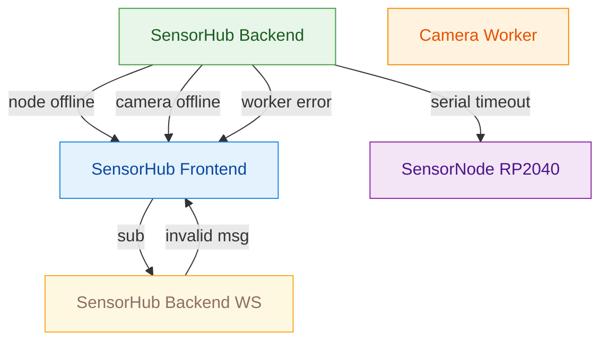

# Error Flows

```mermaid
flowchart TB
  UI[SensorHub Frontend]
  API[SensorHub Backend]
  WS[SensorHub Backend WS]
  Node[SensorNode RP2040]
  Worker[Camera Worker]

  UI -->|sub| WS
  WS -->|invalid msg| UI
  API -->|node offline| UI
  API -->|camera offline| UI
  API -->|worker error| UI
  API -->|serial timeout| Node

  style UI fill:#E3F2FD,stroke:#1E88E5,color:#0D47A1
  style API fill:#E8F5E9,stroke:#43A047,color:#1B5E20
  style WS fill:#FFF8E1,stroke:#F9A825,color:#8D6E63
  style Node fill:#F3E5F5,stroke:#8E24AA,color:#4A148C
  style Worker fill:#FFF3E0,stroke:#FB8C00,color:#E65100
```
