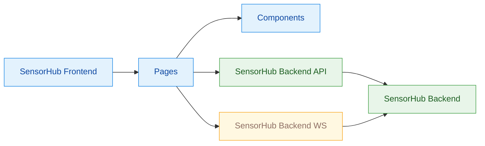
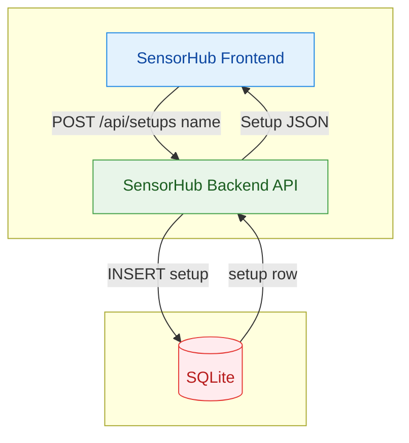
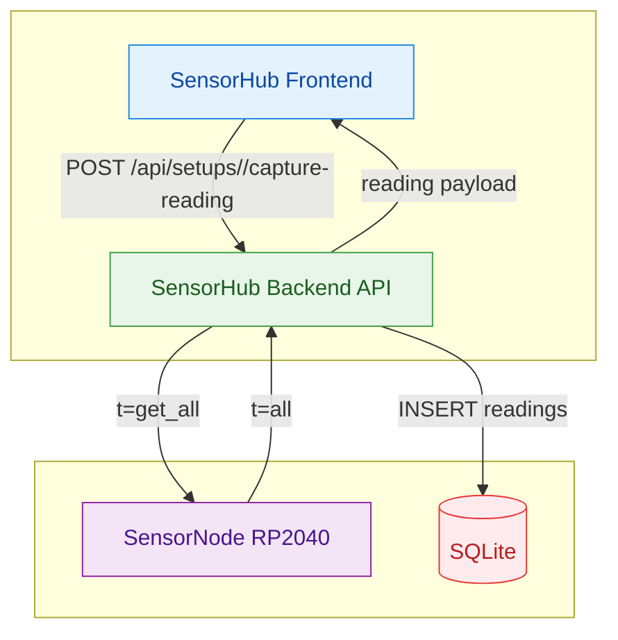

# Frontend and Setups

## Frontend Flow

```mermaid
flowchart LR
  UI[SensorHub Frontend]
  Pages[Pages]
  Components[Components]
  API[SensorHub Backend API]
  WS[SensorHub Backend WS]
  Backend[SensorHub Backend]

  UI --> Pages
  Pages --> Components
  Pages --> API
  Pages --> WS
  API --> Backend
  WS --> Backend

  style UI fill:#E3F2FD,stroke:#1E88E5,color:#0D47A1
  style Pages fill:#E3F2FD,stroke:#1E88E5,color:#0D47A1
  style Components fill:#E3F2FD,stroke:#1E88E5,color:#0D47A1
  style API fill:#E8F5E9,stroke:#43A047,color:#1B5E20
  style WS fill:#FFF8E1,stroke:#F9A825,color:#8D6E63
  style Backend fill:#E8F5E9,stroke:#43A047,color:#1B5E20
```

## Setup Verwaltung

```mermaid
flowchart TB
  subgraph Top[" "]
    direction LR
  UI[SensorHub Frontend]
  API[SensorHub Backend API]
  end

  subgraph Bottom[" "]
    direction LR
    DB[(SQLite)]
  end

  UI -->|POST /api/setups name| API
  API -->|INSERT setup| DB
  DB -->|setup row| API
  API -->|Setup JSON| UI

  style UI fill:#E3F2FD,stroke:#1E88E5,color:#0D47A1
  style API fill:#E8F5E9,stroke:#43A047,color:#1B5E20
  style DB fill:#FFEBEE,stroke:#E53935,color:#B71C1C
```

## Manuelle Messung speichern

```mermaid
flowchart TB
  subgraph Top[" "]
    direction LR
  UI[SensorHub Frontend]
  API[SensorHub Backend API]
  end

  subgraph Bottom[" "]
    direction LR
  Node[SensorNode RP2040]
    DB[(SQLite)]
  end

  UI -->|POST /api/setups/<setupId>/capture-reading| API
  API -->|t=get_all| Node
  Node -->|t=all| API
  API -->|INSERT readings| DB
  API -->|reading payload| UI

  style UI fill:#E3F2FD,stroke:#1E88E5,color:#0D47A1
  style API fill:#E8F5E9,stroke:#43A047,color:#1B5E20
  style Node fill:#F3E5F5,stroke:#8E24AA,color:#4A148C
  style DB fill:#FFEBEE,stroke:#E53935,color:#B71C1C
```
