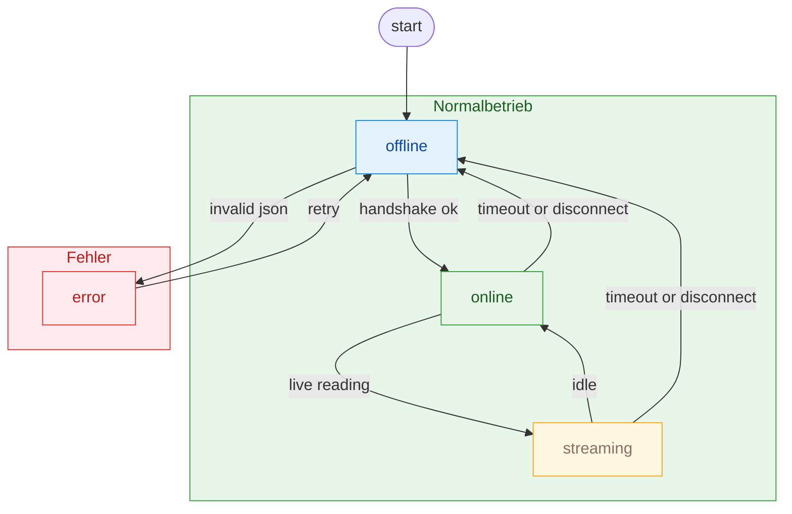

# Node States

```mermaid
flowchart TB
  Start([start])

  subgraph Normalbetrieb
    direction TB
    Offline[offline]
    Online[online]
    Streaming[streaming]
  end

  subgraph Fehler
    direction TB
    Error[error]
  end

  Start --> Offline
  Offline -->|handshake ok| Online
  Online -->|live reading| Streaming
  Streaming -->|idle| Online

  Online -->|timeout or disconnect| Offline
  Streaming -->|timeout or disconnect| Offline
  Offline -->|invalid json| Error
  Error -->|retry| Offline

  style Normalbetrieb fill:#E8F5E9,stroke:#43A047,color:#1B5E20
  style Fehler fill:#FFEBEE,stroke:#E53935,color:#B71C1C
  style Offline fill:#E3F2FD,stroke:#1E88E5,color:#0D47A1
  style Online fill:#E8F5E9,stroke:#43A047,color:#1B5E20
  style Streaming fill:#FFF8E1,stroke:#F9A825,color:#8D6E63
  style Error fill:#FFEBEE,stroke:#E53935,color:#B71C1C
```
