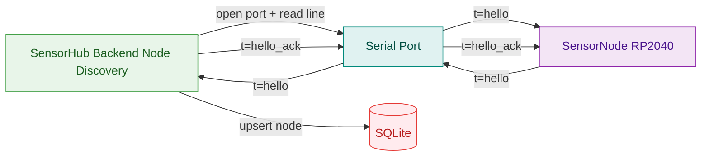
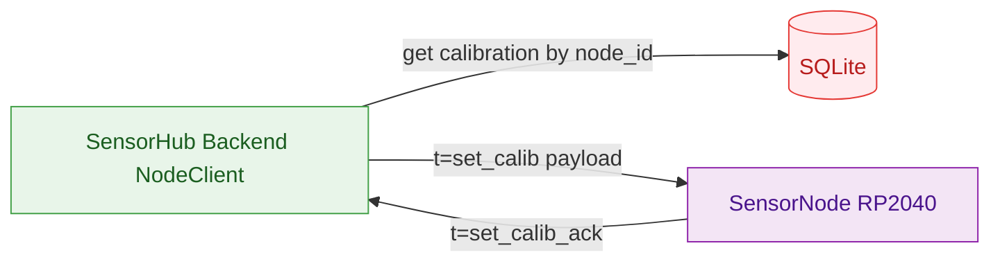
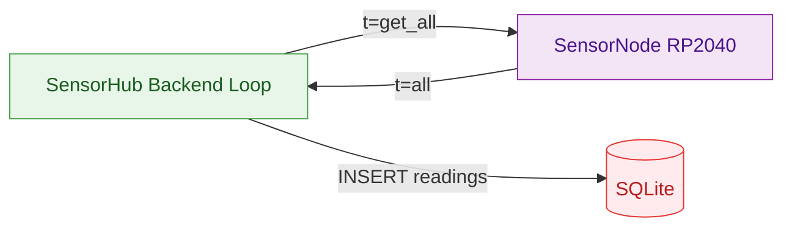
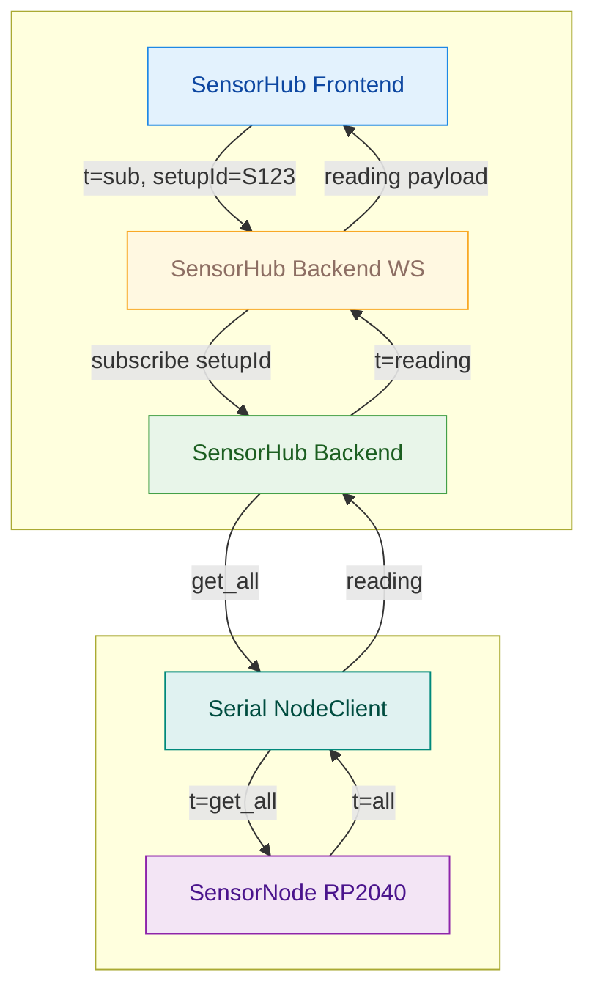
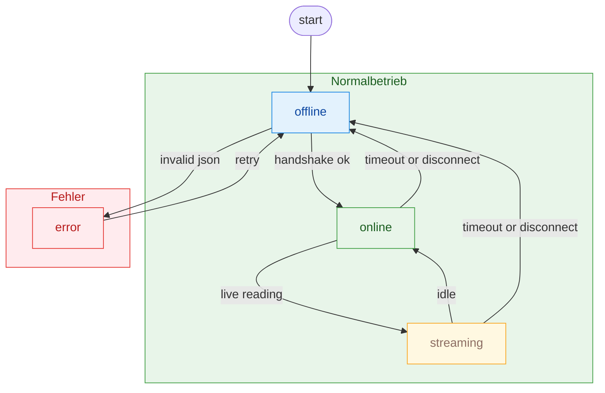

# Nodes

## Node Discovery und Handshake

```mermaid
flowchart LR
  API[SensorHub Backend Node Discovery]
  Serial[Serial Port]
  Node[SensorNode RP2040]
  DB[(SQLite)]

  API -->|open port + read line| Serial
  Serial -->|t=hello| API
  Serial -->|t=hello| Node
  Node -->|t=hello| Serial
  API -->|t=hello_ack| Serial
  Serial -->|t=hello_ack| Node
  API -->|upsert node| DB

  style API fill:#E8F5E9,stroke:#43A047,color:#1B5E20
  style Serial fill:#E0F2F1,stroke:#00897B,color:#004D40
  style Node fill:#F3E5F5,stroke:#8E24AA,color:#4A148C
  style DB fill:#FFEBEE,stroke:#E53935,color:#B71C1C
```

## Kalibrierung Sync

```mermaid
flowchart LR
  API[SensorHub Backend NodeClient]
  DB[(SQLite)]
  Node[SensorNode RP2040]

  API -->|get calibration by node_id| DB
  API -->|t=set_calib payload| Node
  Node -->|t=set_calib_ack| API

  style API fill:#E8F5E9,stroke:#43A047,color:#1B5E20
  style DB fill:#FFEBEE,stroke:#E53935,color:#B71C1C
  style Node fill:#F3E5F5,stroke:#8E24AA,color:#4A148C
```

## Readings Capture Loop (Persistenz)

```mermaid
flowchart LR
  API[SensorHub Backend Loop]
  Node[SensorNode RP2040]
  DB[(SQLite)]

  API -->|t=get_all| Node
  Node -->|t=all| API
  API -->|INSERT readings| DB

  style API fill:#E8F5E9,stroke:#43A047,color:#1B5E20
  style Node fill:#F3E5F5,stroke:#8E24AA,color:#4A148C
  style DB fill:#FFEBEE,stroke:#E53935,color:#B71C1C
```

## Live Reading (Nodes)

```mermaid
flowchart TB
  subgraph Top[" "]
    direction LR
    UI[SensorHub Frontend]
    WS[SensorHub Backend WS]
    Backend[SensorHub Backend]
  end

  subgraph Bottom[" "]
    direction LR
    Serial[Serial NodeClient]
    Node[SensorNode RP2040]
  end

  UI -->|t=sub, setupId=S123| WS
  WS -->|subscribe setupId| Backend
  Backend -->|get_all| Serial
  Serial -->|t=get_all| Node
  Node -->|t=all| Serial
  Serial -->|reading| Backend
  Backend -->|t=reading| WS
  WS -->|reading payload| UI

  style UI fill:#E3F2FD,stroke:#1E88E5,color:#0D47A1
  style WS fill:#FFF8E1,stroke:#F9A825,color:#8D6E63
  style Backend fill:#E8F5E9,stroke:#43A047,color:#1B5E20
  style Serial fill:#E0F2F1,stroke:#00897B,color:#004D40
  style Node fill:#F3E5F5,stroke:#8E24AA,color:#4A148C
```

## Node States

```mermaid
flowchart TB
  Start([start])

  subgraph Normalbetrieb
    direction TB
    Offline[offline]
    Online[online]
    Streaming[streaming]
  end

  subgraph Fehler
    direction TB
    Error[error]
  end

  Start --> Offline
  Offline -->|handshake ok| Online
  Online -->|live reading| Streaming
  Streaming -->|idle| Online

  Online -->|timeout or disconnect| Offline
  Streaming -->|timeout or disconnect| Offline
  Offline -->|invalid json| Error
  Error -->|retry| Offline

  style Normalbetrieb fill:#E8F5E9,stroke:#43A047,color:#1B5E20
  style Fehler fill:#FFEBEE,stroke:#E53935,color:#B71C1C
  style Offline fill:#E3F2FD,stroke:#1E88E5,color:#0D47A1
  style Online fill:#E8F5E9,stroke:#43A047,color:#1B5E20
  style Streaming fill:#FFF8E1,stroke:#F9A825,color:#8D6E63
  style Error fill:#FFEBEE,stroke:#E53935,color:#B71C1C
```
