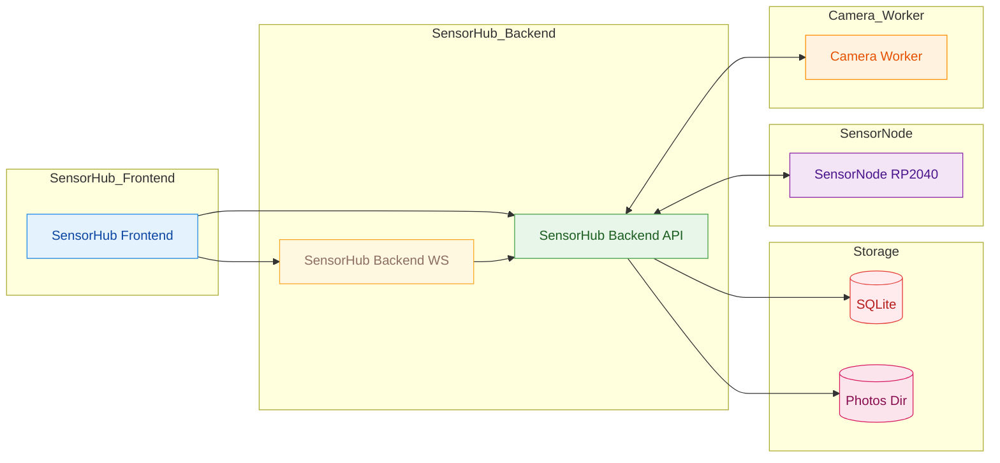
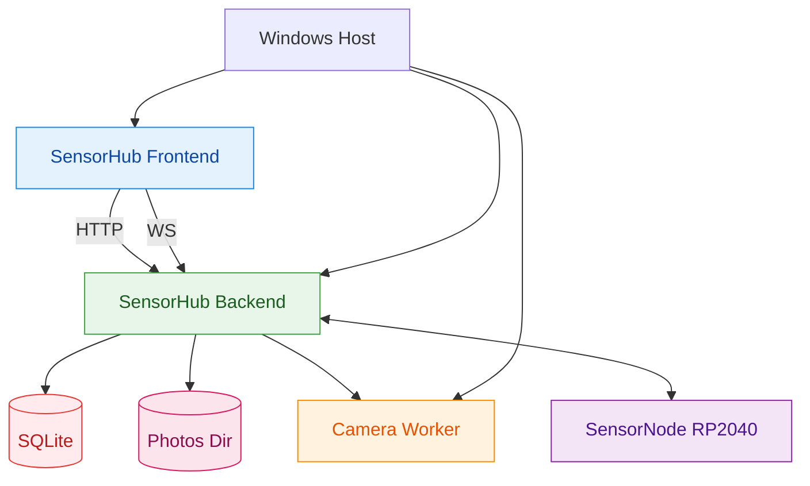
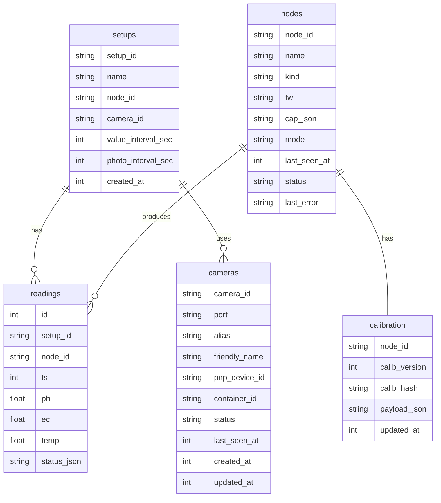
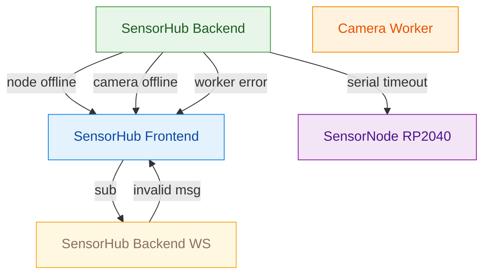

# System Overview

## Komponentenbeziehungen

```mermaid
flowchart LR
  subgraph SensorHub_Frontend
    UI[SensorHub Frontend]
  end

  subgraph SensorHub_Backend
    API[SensorHub Backend API]
    WS[SensorHub Backend WS]
  end

  subgraph Storage
    DB[(SQLite)]
    Photos[(Photos Dir)]
  end

  subgraph SensorNode
    Node[SensorNode RP2040]
  end

  subgraph Camera_Worker
    Worker[Camera Worker]
  end

  UI --> API
  UI --> WS
  WS --> API
  API --> DB
  API --> Photos
  API <--> Node
  API <--> Worker

  %% Farbcode (Flowchart, kompatibel mit Mermaid Preview)
  style UI fill:#E3F2FD,stroke:#1E88E5,color:#0D47A1
  style API fill:#E8F5E9,stroke:#43A047,color:#1B5E20
  style WS fill:#FFF8E1,stroke:#F9A825,color:#8D6E63
  style DB fill:#FFEBEE,stroke:#E53935,color:#B71C1C
  style Photos fill:#FCE4EC,stroke:#D81B60,color:#880E4F
  style Node fill:#F3E5F5,stroke:#8E24AA,color:#4A148C
  style Worker fill:#FFF3E0,stroke:#FB8C00,color:#E65100
```

## Deployment

```mermaid
flowchart TB
  Host[Windows Host]
  Backend[SensorHub Backend]
  Frontend[SensorHub Frontend]
  Worker[Camera Worker]
  DB[(SQLite)]
  Photos[(Photos Dir)]
  Node[SensorNode RP2040]

  Frontend -->|HTTP| Backend
  Frontend -->|WS| Backend
  Backend --> DB
  Backend --> Photos
  Backend --> Worker
  Backend <--> Node
  Host --> Backend
  Host --> Frontend
  Host --> Worker

  style Frontend fill:#E3F2FD,stroke:#1E88E5,color:#0D47A1
  style Backend fill:#E8F5E9,stroke:#43A047,color:#1B5E20
  style Worker fill:#FFF3E0,stroke:#FB8C00,color:#E65100
  style DB fill:#FFEBEE,stroke:#E53935,color:#B71C1C
  style Photos fill:#FCE4EC,stroke:#D81B60,color:#880E4F
  style Node fill:#F3E5F5,stroke:#8E24AA,color:#4A148C
```

# Data Model ER

```mermaid
erDiagram
  setups ||--o{ readings : has
  nodes ||--o{ readings : produces
  setups ||--o{ cameras : uses
  nodes ||--|| calibration : has

  setups {
    string setup_id
    string name
    string node_id
    string camera_id
    int value_interval_sec
    int photo_interval_sec
    int created_at
  }

  nodes {
    string node_id
    string name
    string kind
    string fw
    string cap_json
    string mode
    int last_seen_at
    string status
    string last_error
  }

  readings {
    int id
    string setup_id
    string node_id
    int ts
    float ph
    float ec
    float temp
    string status_json
  }

  cameras {
    string camera_id
    string port
    string alias
    string friendly_name
    string pnp_device_id
    string container_id
    string status
    int last_seen_at
    int created_at
    int updated_at
  }

  calibration {
    string node_id
    int calib_version
    string calib_hash
    string payload_json
    int updated_at
  }
```
# Error Flows

```mermaid
flowchart TB
  UI[SensorHub Frontend]
  Backend[SensorHub Backend]
  WS[SensorHub Backend WS]
  Node[SensorNode RP2040]
  Worker[Camera Worker]

  UI -->|sub| WS
  WS -->|invalid msg| UI
  Backend -->|node offline| UI
  Backend -->|camera offline| UI
  Backend -->|worker error| UI
  Backend -->|serial timeout| Node

  style UI fill:#E3F2FD,stroke:#1E88E5,color:#0D47A1
  style Backend fill:#E8F5E9,stroke:#43A047,color:#1B5E20
  style WS fill:#FFF8E1,stroke:#F9A825,color:#8D6E63
  style Node fill:#F3E5F5,stroke:#8E24AA,color:#4A148C
  style Worker fill:#FFF3E0,stroke:#FB8C00,color:#E65100
```
