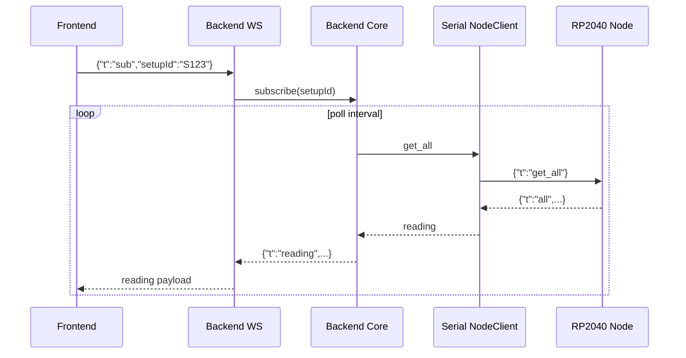
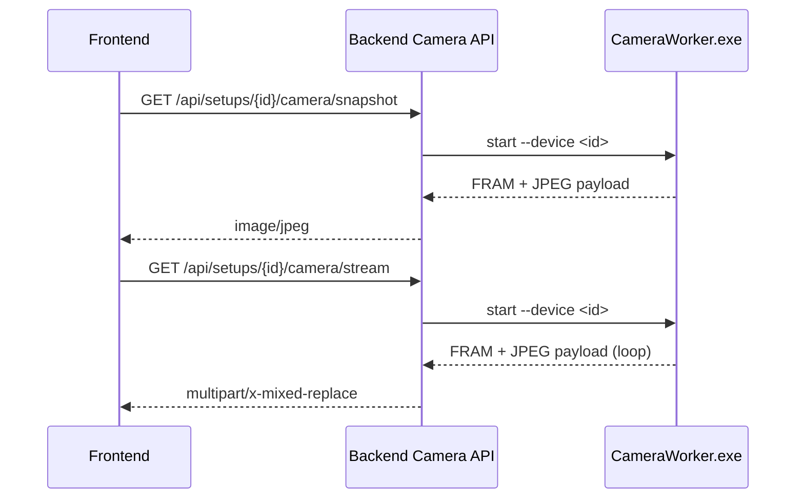
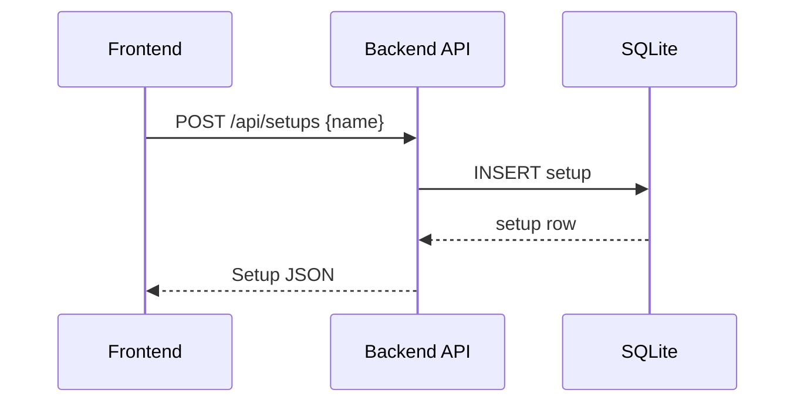
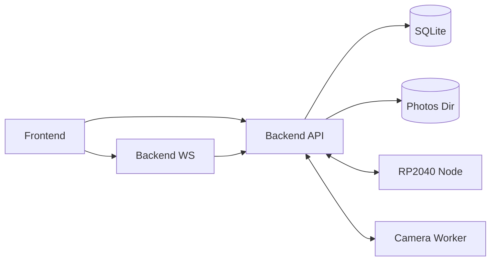

# Diagramme

## Live Reading Flow

```mermaid
sequenceDiagram
  participant UI as Frontend
  participant WS as Backend WS
  participant API as Backend Core
  participant Serial as Serial NodeClient
  participant Node as RP2040 Node

  UI->>WS: {"t":"sub","setupId":"S123"}
  WS->>API: subscribe(setupId)
  loop poll interval
    API->>Serial: get_all
    Serial->>Node: {"t":"get_all"}
    Node-->>Serial: {"t":"all",...}
    Serial-->>API: reading
    API-->>WS: {"t":"reading",...}
    WS-->>UI: reading payload
  end
```

## Kamera Snapshot / Stream

```mermaid
sequenceDiagram
  participant UI as Frontend
  participant API as Backend Camera API
  participant Worker as CameraWorker.exe

  UI->>API: GET /api/setups/{id}/camera/snapshot
  API->>Worker: start --device <id>
  Worker-->>API: FRAM + JPEG payload
  API-->>UI: image/jpeg

  UI->>API: GET /api/setups/{id}/camera/stream
  API->>Worker: start --device <id>
  Worker-->>API: FRAM + JPEG payload (loop)
  API-->>UI: multipart/x-mixed-replace
```

## Setup Verwaltung

```mermaid
sequenceDiagram
  participant UI as Frontend
  participant API as Backend API
  participant DB as SQLite

  UI->>API: POST /api/setups {name}
  API->>DB: INSERT setup
  DB-->>API: setup row
  API-->>UI: Setup JSON
```

## Komponentenbeziehungen

```mermaid
flowchart LR
  UI[Frontend]
  API[Backend API]
  WS[Backend WS]
  DB[(SQLite)]
  Photos[(Photos Dir)]
  Node[RP2040 Node]
  Worker[Camera Worker]

  UI --> API
  UI --> WS
  API --> DB
  API --> Photos
  WS --> API
  API <--> Node
  API <--> Worker
```
