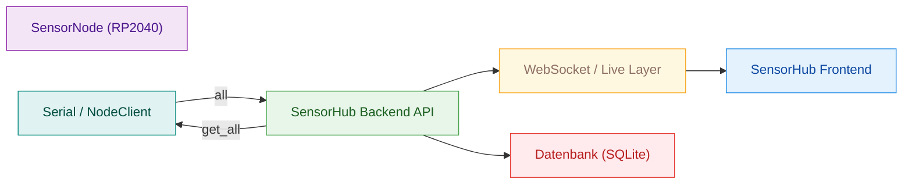
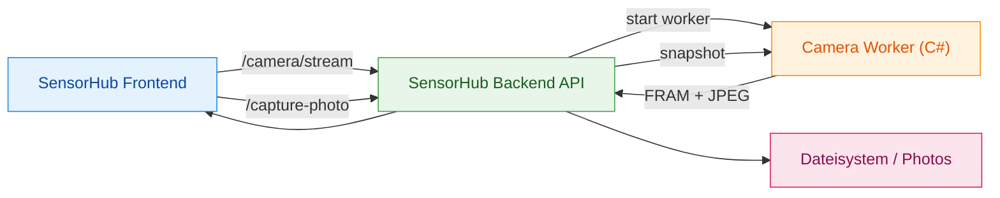

# Protokolle

## Serial JSON Line Protocol
Die Kommunikation zwischen Backend und SensorNode erfolgt über UART mit JSON-Nachrichten, die jeweils durch `\n` abgeschlossen sind. Das erleichtert robustes Parsen und erlaubt einfache Debug-Ausgaben.

Beispiel (JSON pro Zeile):
```json
{"t":"get_all"}
{"t":"all","ts":1700000000000,"ph":6.8,"ec":1.4,"temp":22.1,"status":["ok"]}
```

Wichtige Nachrichtentypen:
- `hello` / `hello_ack`: Handshake und Capabilities
- `get_all` / `all`: Abfrage der aktuellen Messwerte
- `set_mode`: Umschalten zwischen `real` und `debug`
- `set_sim`: Setzen von Simulationswerten
- `set_calib` / `set_calib_ack`: Kalibrierungsdaten übertragen

### set_sim (Serial)
Die Node erwartet die Felder `ph`, `ec`, `temp` direkt im Payload.

Beispiel:
```json
{"t":"set_sim","ph":6.5,"ec":1.7,"temp":22.3}
```

### set_calib (Serial)
Kalibrierungsdaten werden als `payload` Objekt gesendet. Die Node liest `payload`
und quittiert mit `set_calib_ack`.

Beispiel:
```json
{"t":"set_calib","version":2,"payload":{"ph":{"m":1.0,"b":0.0}}}
```

## UID-basierter Handshake (hello / hello_ack)
Der Handshake identifiziert Nodes über eine stabile UID und übergibt Capabilities sowie Kalibrierungs-Hash. Das Diagramm zeigt die minimalen Schritte vom ersten Kontakt bis zum akzeptierten Node-Client.

```mermaid
flowchart LR
    SensorNode["SensorNode (RP2040)"]
    SerialNodeClient["Serial / NodeClient"]
    BackendAPI["SensorHub Backend API"]
    Database["Datenbank (SQLite)"]

    SensorNode -->|hello JSON Line| SerialNodeClient
    SerialNodeClient -->|hello_ack JSON Line| SensorNode
    SerialNodeClient --> BackendAPI
    BackendAPI --> Database

    classDef frontend fill:#E3F2FD,stroke:#1E88E5,color:#0D47A1;
    classDef backend fill:#E8F5E9,stroke:#43A047,color:#1B5E20;
    classDef live fill:#FFF8E1,stroke:#F9A825,color:#8D6E63;
    classDef serial fill:#E0F2F1,stroke:#00897B,color:#004D40;
    classDef node fill:#F3E5F5,stroke:#8E24AA,color:#4A148C;
    classDef worker fill:#FFF3E0,stroke:#FB8C00,color:#E65100;
    classDef db fill:#FFEBEE,stroke:#E53935,color:#B71C1C;
    classDef photos fill:#FCE4EC,stroke:#D81B60,color:#880E4F;

    class SerialNodeClient serial;
    class SensorNode node;
    class BackendAPI backend;
    class Database db;
```



- Die Node meldet sich aktiv per `hello`, der Backend-Client bestätigt mit `hello_ack`.
- UID und Capabilities werden gespeichert, damit spätere Reads korrekt geroutet werden.
- Der Handshake ist die Basis für Online/Offline-Status und Kalibrierungsabgleich.

## Live Reading Message Flow
Live-Readings werden durch die Backend-Loop zyklisch abgefragt und per WebSocket an abonnierte Clients gesendet. Das Diagramm zeigt den Datenfluss vom Sensor bis ins Frontend.



- Die zyklische Abfrage erzeugt sowohl Live-Updates als auch persistente Historie.
- WebSocket-Subscriptions sind setup-basiert, wodurch mehrere Setups parallel unterstützt werden.
- Das Frontend erhält nur relevante Daten, nicht den gesamten Datenstrom.

## WebSocket Messages (sub/unsub/reading/cameraDevices/…)
WebSocket-Kommunikation läuft über `/api/live`. Der Client abonniert Setups und erhält Messwerte sowie Kamera-Gerätelisten.

Client:
- `{ "t": "sub", "setupId": "S1234" }`
- `{ "t": "unsub", "setupId": "S1234" }`

Server:
- `{ "t": "reading", "setupId": "...", "ts": 123, "ph": 6.8, "ec": 1.4, "temp": 22.1, "status": ["ok"] }`
- `{ "t": "cameraDevices", "devices": [ ... ] }`
- `{ "t": "reset", "reason": "..." }`
- `{ "t": "error", "setupId"?: "...", "msg": "..." }`

## Camera Worker Protocol (list/device streaming)
Der Camera Worker ist ein separater Prozess. Er liefert Frames als Binärformat mit Header und JPEG-Payload. `--list` gibt eine JSON-Liste der Devices aus, `--device <id>` streamt Frames.

Dieses Diagramm zeigt den Ablauf für Snapshot/Stream inklusive Speicherung von Fotos.



- Der Stream nutzt fortlaufende Frames; ein Snapshot speichert zusätzlich ein JPEG im Dateisystem.
- Die Frontend-Preview verwendet den Stream-Endpunkt, Fotos werden per Capture-Endpoint ausgelöst.
- Der Worker kapselt die Windows-spezifische Kameraschnittstelle und bleibt austauschbar.
