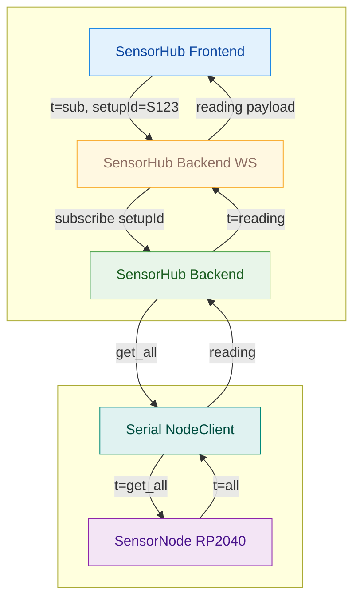
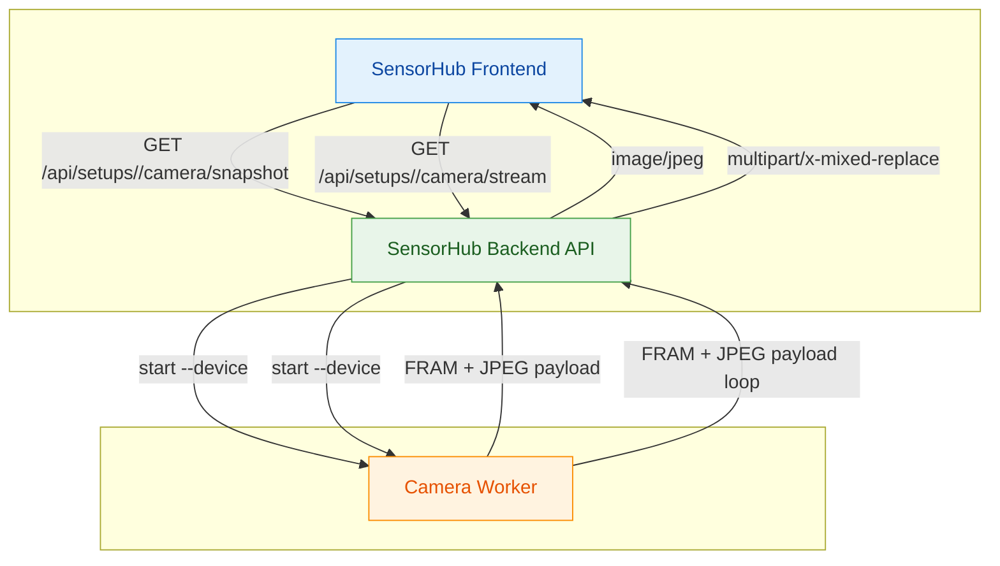

# Protokolle

Diese Datei beschreibt die genutzten Protokolle zwischen SensorNode, SensorHub Backend,
SensorHub Frontend und Camera Worker.

## 1) Serial JSON Line Protocol (SensorNode <-> SensorHub Backend)

Transport: UART/USB Serial, 115200 Baud. Jede Nachricht ist eine JSON-Zeile
(`\n`-terminiert).

### Ablauf (Live Reading)



### Handshake

**SensorNode -> SensorHub Backend**
```json
{"t":"hello","fw":"pico-0.1.0","cap":{"ph":true,"ec":true,"temp":true,"debug":true,"calib":true,"pins":{"ph":"adc2","ec":"adc0","temp":"gpio17"}},"calibHash":"default"}
```

**SensorHub Backend -> SensorNode**
```json
{"t":"hello_ack","fw":"pico-0.1.0","cap":{...},"calibHash":"default"}
```

### Messwerte

**SensorHub Backend -> SensorNode**
```json
{"t":"get_all"}
```

**SensorNode -> SensorHub Backend**
```json
{"t":"all","ts":123456,"mode":"real","status":["ok"],"ph":6.5,"ec":1.7,"temp":22.1}
```

### Node Modus

**SensorHub Backend -> SensorNode**
```json
{"t":"set_mode","mode":"debug"}
```

### Debug Simulation

**SensorHub Backend -> SensorNode**
```json
{"t":"set_sim","ph":6.4,"ec":1.5,"temp":21.8}
```

### Kalibrierung

**SensorHub Backend -> SensorNode**
```json
{"t":"set_calib","version":1,"payload":{"ph":{"points":[{"raw":0.0,"val":0.0},{"raw":1.65,"val":7.0},{"raw":3.3,"val":14.0}]},"ec":{"points":[{"raw":0.0,"val":0.0},{"raw":3.3,"val":5.0}]},"calibHash":"abc123"}}
```

**SensorNode -> SensorHub Backend**
```json
{"t":"set_calib_ack"}
```

## 2) WebSocket Protocol (SensorHub Frontend <-> SensorHub Backend)

Endpoint: `ws://<sensorhub-backend>/api/live`

### SensorHub Frontend -> SensorHub Backend
```json
{"t":"sub","setupId":"S12345678"}
{"t":"unsub","setupId":"S12345678"}
```

### SensorHub Backend -> SensorHub Frontend
```json
{"t":"reading","setupId":"S12345678","ts":123456,"ph":6.5,"ec":1.7,"temp":22.1,"status":["ok"]}
{"t":"cameraDevices","devices":[{"cameraId":"usb1234","deviceId":"usb1234","alias":"Kamera USB","pnpDeviceId":"USB\\VID_046D&PID_0825","friendlyName":"Logitech HD","containerId":"{...}","status":"online"}]}
{"t":"reset","reason":"db-reset"}
{"t":"error","setupId":"S12345678","msg":"setup missing"}
{"t":"error","msg":"unknown message"}
```

## 3) Camera Worker Protocol (SensorHub Backend <-> Camera Worker)

Der Camera Worker liefert zwei Modi:

- `--list` gibt JSON mit Kamera-Infos auf Stdout aus.
- `--device <id>` streamt Frames als Binary-Stream.

### Frame Header (Binary)

Header-Len: 32 Bytes (Little Endian). Byte-Offsets:

- `0..4` Magic (4 Bytes, `FRAM`)
- `4..6` Version (2 Bytes)
- `6..8` HeaderLen (2 Bytes, kann > 32 sein)
- `8..16` Sequence (8 Bytes)
- `16..24` TimestampMs (8 Bytes)
- `24..26` DeviceIdLen (2 Bytes)
- `26..28` MimeLen (2 Bytes)
- `28..32` PayloadLen (4 Bytes)

Danach folgen:

1. DeviceId UTF-8 Bytes
2. MIME UTF-8 Bytes (z.B. `image/jpeg`)
3. JPEG Payload

### Snapshot / Stream (Uebersicht)



## 4) HTTP REST (SensorHub Frontend <-> SensorHub Backend)

REST nutzt JSON ueber HTTP. Details siehe `api.md`.
