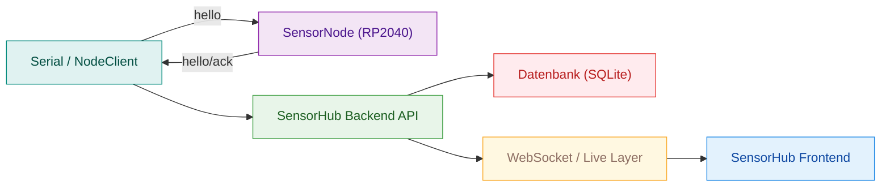

# Laufzeitverhalten

## Startup und Loop-Aktivierung
Beim Start initialisiert das Backend die Datenbank, aktiviert die Live-Schicht und startet vier zentrale Loops. Das folgende Diagramm zeigt die Reihenfolge und die daraus entstehenden Laufzeitpfade.

```mermaid
flowchart TD
    BackendAPI["SensorHub Backend API"]
    LiveLayer["WebSocket / Live Layer"]
    Database["Datenbank (SQLite)"]
    NodeDiscoveryLoop["Node Discovery Loop"]
    ReadingsCaptureLoop["Readings Capture Loop"]
    CameraDiscoveryLoop["Camera Discovery Loop"]
    PhotoCaptureLoop["Photo Capture Loop"]

    BackendAPI --> Database
    BackendAPI --> LiveLayer
    BackendAPI --> NodeDiscoveryLoop
    BackendAPI --> ReadingsCaptureLoop
    BackendAPI --> CameraDiscoveryLoop
    BackendAPI --> PhotoCaptureLoop

    classDef frontend fill:#E3F2FD,stroke:#1E88E5,color:#0D47A1;
    classDef backend fill:#E8F5E9,stroke:#43A047,color:#1B5E20;
    classDef live fill:#FFF8E1,stroke:#F9A825,color:#8D6E63;
    classDef serial fill:#E0F2F1,stroke:#00897B,color:#004D40;
    classDef node fill:#F3E5F5,stroke:#8E24AA,color:#4A148C;
    classDef worker fill:#FFF3E0,stroke:#FB8C00,color:#E65100;
    classDef db fill:#FFEBEE,stroke:#E53935,color:#B71C1C;
    classDef photos fill:#FCE4EC,stroke:#D81B60,color:#880E4F;

    class BackendAPI backend;
    class LiveLayer live;
    class Database db;
```

- Die DB wird als erstes vorbereitet, damit Loops sofort persistieren können.
- LiveLayer startet früh, um spätere Subscriptions direkt bedienen zu können.
- Jeder Loop läuft unabhängig, um Ausfälle zu isolieren.

## Zustandsmodell: Online/Offline und Discovery
Nodes werden über einen Discovery-Zyklus gesucht. Der Online-Status ergibt sich aus Handshake und `last_seen_at`-Aktualisierungen, Offline-Zustände entstehen bei Timeouts oder ausbleibender Antwort.

- Online wird ein Node durch erfolgreichen Handshake und regelmäßige Antworten.
- `last_seen_at` wird bei aktiver Kommunikation aktualisiert.
- LiveLayer kann Statusänderungen in Echtzeit an Clients weitergeben.

## Typische Fehlerpfade (logische Sicht)
- **Node offline**: Kein `hello` bzw. keine Antwort auf `get_all` → Node wird als offline markiert.
- **Kamera nicht verfügbar**: Worker liefert keine Frames → Frontend sieht leere Preview, Backend protokolliert Fehler.
- **Setup ohne Node**: Readings-Loop überspringt Setups ohne `node_id`.
